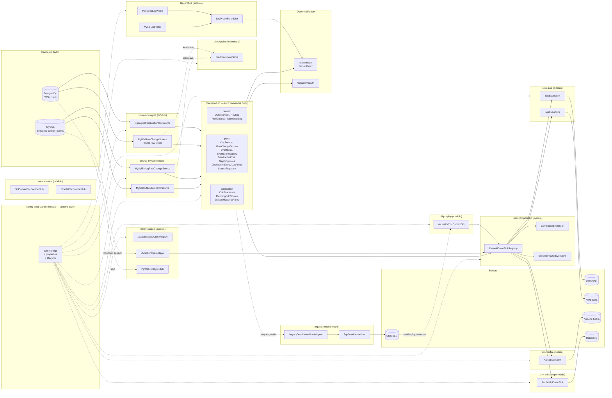
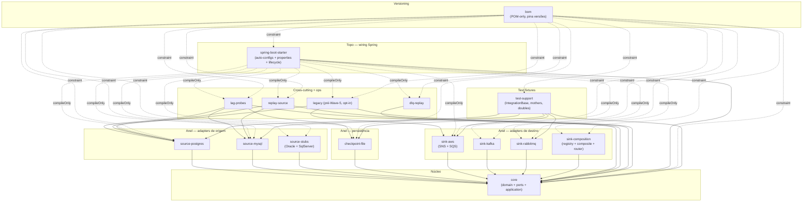
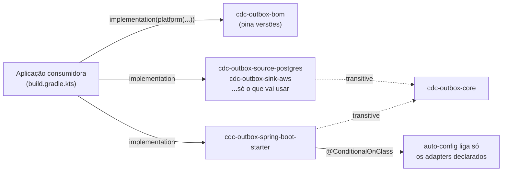

# cdc-outbox-event-producer


> **Status:** repositório revivido a partir do arquivo público
> [`inventa-shop/kotlin-postgres-cdc-to-sns-module`](https://github.com/inventa-shop/kotlin-postgres-cdc-to-sns-module)
> (último commit Fev/2024) e republicado privadamente para evoluir o
> desenho. A partir da Onda 3 o projeto se reorganizou em hexagonal e
> ganhou suporte a múltiplas origens (Postgres / MySQL) e múltiplos
> brokers (SNS / SQS / Kafka / RabbitMQ).

Biblioteca Kotlin/JVM (publicável como Spring Boot starter) que
**transforma um banco de dados relacional em produtor de eventos**
seguindo o **Transactional Outbox Pattern**. Captura mudanças no banco
de origem (logical replication slot do PostgreSQL, binlog ou tabela
outbox no MySQL) e publica nos brokers configurados, com garantia
**at-least-once**, retry com backoff exponencial + jitter, dead-letter
opcional, métricas Micrometer e health indicator Actuator.

---

## Sumário

1. [Arquitetura funcional](#arquitetura-funcional)
2. [Arquitetura técnica (visão executiva)](#arquitetura-técnica-visão-executiva)
3. [Diagrama hexagonal](#diagrama-hexagonal)
4. [Etapas do processo](#etapas-do-processo)
5. [Players integrados](#players-integrados)
6. [Quick start](#quick-start)
7. [Convenção de routing](#convenção-de-routing)
8. [Referência de configuração](#referência-de-configuração)
9. [Alternativas no ecossistema](#alternativas-no-ecossistema)
10. [Roadmap](#roadmap)
11. [Testes e build local](#testes-e-build-local)
12. [Trabalhando com Claude / agentes de IA neste repositório](#trabalhando-com-claude--agentes-de-ia-neste-repositório)
13. [Licença e créditos](#licença-e-créditos)

---

## Arquitetura funcional

### O que o producer faz

O serviço fica observando um banco de dados (Postgres ou MySQL) e
**emite eventos para brokers de mensageria sempre que mudanças
relevantes acontecem dentro de transações de negócio**. A garantia
chave é: ou o INSERT/UPDATE da aplicação e o evento publicado existem
ambos, ou nenhum dos dois — sem janela em que a aplicação acreditou
que persistiu mas o evento se perdeu.

Quem emite? A própria aplicação consumidora, escrevendo dentro da
transação de negócio:

  * **No Postgres:** chamando `pg_logical_emit_message(true, '<scheme>://<target>', '<json>')`
    no mesmo `BEGIN`/`COMMIT` do INSERT da entidade. A mensagem viaja
    pelo WAL junto com a row, então fica atômica com ela. Não existe
    tabela outbox — esse é o ponto da variante "WAL message" do
    pattern (contraste em [Outbox vs publish-while-committing](#outbox-vs-publish-while-committing)).
  * **No MySQL (poller):** fazendo `INSERT INTO outbox_events(prefix,
    payload, headers)` dentro da transação. O producer consome a
    tabela com `SELECT … FOR UPDATE SKIP LOCKED` e marca cada row como
    publicada.
  * **No MySQL (binlog):** o aplicativo faz INSERT/UPDATE/DELETE
    normalmente nas tabelas mapeadas. O producer lê o binlog em modo
    `ROW`, filtra pelas tabelas configuradas em `cdc.outbox.mappings`
    e projeta cada row em `OutboxEvent`.

O `OutboxEvent` resultante carrega `id` (LSN, GTID ou PK), `routing`
(`scheme://target`), `payload` (bytes opacos) e `headers`. O producer
resolve o broker pelo `scheme` (`sns`, `sqs`, `kafka`, `amqp`) e
publica.

### Outbox vs publish-while-committing

A variante de PostgreSQL com `pg_logical_emit_message` **não** é
exatamente "Transactional Outbox" tradicional — é uma forma de
"publish-while-committing" onde a tabela outbox é substituída por uma
mensagem lógica na WAL. As propriedades funcionais são equivalentes
(emissão atômica com o commit da transação), mas:

  * **Pattern clássico (outbox table):** tabela `outbox_events` no
    banco, INSERT junto da transação, poller separado consome e
    publica. Visível e auditável no banco; latência mais alta; usado
    no nosso adapter MySQL poller.
  * **WAL message (Postgres):** mensagem só existe no slot
    de replicação, nunca encosta em tabela. Latência menor;
    visibilidade é só nos logs/Actuator do producer; usado no nosso
    adapter Postgres logical.
  * **Row-level CDC (MySQL binlog):** não há intenção explícita do
    aplicativo de emitir evento — o producer infere os eventos das
    mudanças nas tabelas mapeadas. Custo zero pra quem produz, mas
    exige `cdc.outbox.mappings` correto.

Os três usam exatamente a mesma porta `CdcSource` (eventualmente via
`MappingCdcSource` + `MappingRules`), e o orquestrador `CdcProcessor`
não sabe qual sabor está rodando.

### Garantias

  * **At-least-once.** O checkpoint da origem (LSN no Postgres, GTID
    ou `<file>:<pos>` no MySQL binlog, PK no MySQL poller) só avança
    depois do publish OK ou do dead-letter OK. Duplicatas downstream
    são consequência aceita do contrato — consumers devem deduplicar
    por `event.id`.
  * **Backoff exponencial com jitter.** Falhas transientes (broker
    fora, timeout) entram em retry head-of-line. `cdc.outbox.retry.*`
    controla limites e tempos.
  * **Dead-letter opcional.** Configurar `cdc.outbox.dead-letter.queue-name`
    instala um `DeadLetterPort` para SQS. Sem isso, mensagens que
    esgotam retry **ficam presas** no slot até intervenção do operador
    — é deliberado, melhor pausar que perder.
  * **Shutdown limpo.** O loop conclui o ciclo atual e termina sem
    avançar checkpoint a meio caminho. Se uma mensagem estava em
    retry, encerra sem ack — o próximo start replaya.
  * **Single-writer por slot/source.** Postgres rejeita dois readers
    no mesmo slot (SQLSTATE 55006). O MySQL poller depende do `FOR
    UPDATE SKIP LOCKED`. Cada instância da aplicação roda um
    `CdcProcessor`; deploys multi-AZ devem fixar o slot a uma
    réplica ativa.

### Modos de falha visíveis

| Sintoma                                      | O que aconteceu                                         | Onde olhar primeiro                                        |
|----------------------------------------------|---------------------------------------------------------|------------------------------------------------------------|
| `/actuator/health` → `DOWN`                  | Loop não está iterando, ou publish falhou e está preso. | `details.pendingFailureLsn` (legado) ou `details.pendingFailureCheckpoint` (hex), `details.reason`, logs ERROR. |
| Slot do Postgres crescendo (lag bytes)       | Producer parado, ou broker fora há muito tempo.         | Métrica `cdc.outbox.messages.failed` por cause.            |
| `cdc.outbox.dead_letter.failures` > 0        | A DLQ também falhou — operador deve atuar.              | Logs ERROR; configuração da queue SQS.                     |
| Eventos publicados duas vezes                | Producer reiniciou no meio de um publish.               | Esperado em at-least-once; consumer precisa dedup.         |
| `NoSinkForSchemeException` repetida          | Routing aponta para scheme sem adapter na classpath.    | Confira `cdc.outbox.mappings[].routing.sink` + jars de sink. |

## Arquitetura técnica (visão executiva)

> Documento completo, port-by-port, em
> [`docs/ARCHITECTURE.md`](docs/ARCHITECTURE.md). Esta seção é o resumo.

Layout hexagonal, hoje materializado como **15 módulos Gradle** + 1 BOM
(Wave 6 + Wave 7). Cada módulo publica uma coordenada Maven própria
(`cdc-outbox-<módulo>`); o BOM (`cdc-outbox-bom`) pina versões.
Detalhe na seção [Instalação (Wave 7 — multi-artifact)](#instalação-wave-7--multi-artifact).

```
core/                          ← Kotlin puro, sem Spring, sem drivers
├── domain/   OutboxEvent, Routing, RowChange, TableMapping
├── port/     CdcSource, RowChangeSource (driving)
│             EventSink, EventSinkRegistry, DeadLetterPort, MappingRules,
│             CheckpointStore, LagProbe, SourceReplayer (driven)
└── application/  CdcProcessor, MappingCdcSource, DefaultMappingRules

source-postgres/               ← PgLogicalReplicationCdcSource + PgWalRowChangeSource
                                 + replication/ infra (slot, parser wal2json v1/v2, pool)
source-mysql/                  ← MySqlOutboxTableCdcSource + MySqlBinlogRowChangeSource
source-stubs/                  ← Oracle + SqlServer stubs (fail-fast)

sink-aws/                      ← SnsEventSink + SqsEventSink (SCA 3.2, AWS SDK v2)
sink-kafka/                    ← KafkaEventSink (spring-kafka KafkaTemplate)
sink-rabbitmq/                 ← RabbitMqEventSink (spring-amqp RabbitTemplate)
sink-composition/              ← DefaultEventSinkRegistry + CompositeEventSink
                                 + SchemeRouterEventSink

checkpoint-file/               ← FileCheckpointStore (Onda 5.2; default opt-in)
lag-probes/                    ← Postgres/MySQL LagProbe + LagProbeScheduler

dlq-replay/                    ← /actuator/cdcOutboxDlq (Round 14)
replay-source/                 ← /actuator/cdcOutboxReplay (Round 15)

legacy/                        ← chain pré-Onda 5 (SlotReaderMessageProducer + DLQ legado)
                                 opt-in via cdc.outbox.processor.kind=LEGACY

spring-boot-starter/           ← auto-configs + properties + lifecycle
                                 único módulo que conhece a superfície inteira

bom/                           ← POM-only, pina versões para o consumidor
test-support/                  ← fixtures de teste compartilhadas (só testImplementation)
```

  * **Domínio:**
    [`OutboxEvent`](src/main/kotlin/br/com/fltech/cdc/outbox/publisher/core/domain/OutboxEvent.kt),
    [`Routing`](src/main/kotlin/br/com/fltech/cdc/outbox/publisher/core/domain/Routing.kt),
    [`RowChange`](src/main/kotlin/br/com/fltech/cdc/outbox/publisher/core/domain/RowChange.kt),
    [`TableMapping`](src/main/kotlin/br/com/fltech/cdc/outbox/publisher/core/domain/TableMapping.kt).
    Tipos de valor imutáveis, `equals`/`hashCode` corretos para `ByteArray`.
  * **Portas driving** (entrada):
    [`CdcSource`](src/main/kotlin/br/com/fltech/cdc/outbox/publisher/core/port/CdcSource.kt)
    (alto nível, entrega `OutboxEvent`) e
    [`RowChangeSource`](src/main/kotlin/br/com/fltech/cdc/outbox/publisher/core/port/RowChangeSource.kt)
    (baixo nível, entrega `RowChange`). Single-thread por instância.
  * **Portas driven** (saída):
    [`EventSink`](src/main/kotlin/br/com/fltech/cdc/outbox/publisher/core/port/EventSink.kt),
    [`EventSinkRegistry`](src/main/kotlin/br/com/fltech/cdc/outbox/publisher/core/port/EventSinkRegistry.kt),
    [`DeadLetterPort`](src/main/kotlin/br/com/fltech/cdc/outbox/publisher/core/port/DeadLetterPort.kt),
    [`MappingRules`](src/main/kotlin/br/com/fltech/cdc/outbox/publisher/core/port/MappingRules.kt),
    [`CheckpointStore`](src/main/kotlin/br/com/fltech/cdc/outbox/publisher/core/port/CheckpointStore.kt)
    (persistência de checkpoint por origem, Onda 5.2). Interfaces
    puras sem dependência de framework ou driver.
  * **Aplicação:**
    [`CdcProcessor`](src/main/kotlin/br/com/fltech/cdc/outbox/publisher/core/application/CdcProcessor.kt)
    (loop hexagonal),
    [`MappingCdcSource`](src/main/kotlin/br/com/fltech/cdc/outbox/publisher/core/application/MappingCdcSource.kt)
    (decorator `RowChangeSource` → `CdcSource`),
    [`DefaultMappingRules`](src/main/kotlin/br/com/fltech/cdc/outbox/publisher/core/application/DefaultMappingRules.kt)
    (motor de `TableMapping`).
  * **Adaptadores de origem:**
    [`PgLogicalReplicationCdcSource`](src/main/kotlin/br/com/fltech/cdc/outbox/publisher/adapter/source/postgres/PgLogicalReplicationCdcSource.kt),
    [`PgWalRowChangeSource`](src/main/kotlin/br/com/fltech/cdc/outbox/publisher/adapter/source/postgres/PgWalRowChangeSource.kt)
    (row-level wal2json `I/U/D`, Onda 5.2),
    [`MySqlOutboxTableCdcSource`](src/main/kotlin/br/com/fltech/cdc/outbox/publisher/adapter/source/mysql/MySqlOutboxTableCdcSource.kt),
    [`MySqlBinlogRowChangeSource`](src/main/kotlin/br/com/fltech/cdc/outbox/publisher/adapter/source/mysql/MySqlBinlogRowChangeSource.kt),
    e stubs SQL Server / Oracle.
  * **Adaptadores de destino:**
    [`SnsEventSink`](src/main/kotlin/br/com/fltech/cdc/outbox/publisher/adapter/sink/sns/SnsEventSink.kt),
    [`SqsEventSink`](src/main/kotlin/br/com/fltech/cdc/outbox/publisher/adapter/sink/sqs/SqsEventSink.kt),
    [`KafkaEventSink`](src/main/kotlin/br/com/fltech/cdc/outbox/publisher/adapter/sink/kafka/KafkaEventSink.kt),
    [`RabbitMqEventSink`](src/main/kotlin/br/com/fltech/cdc/outbox/publisher/adapter/sink/rabbitmq/RabbitMqEventSink.kt),
    [`CompositeEventSink`](src/main/kotlin/br/com/fltech/cdc/outbox/publisher/adapter/sink/composite/CompositeEventSink.kt),
    [`SchemeRouterEventSink`](src/main/kotlin/br/com/fltech/cdc/outbox/publisher/adapter/sink/router/SchemeRouterEventSink.kt),
    [`DefaultEventSinkRegistry`](src/main/kotlin/br/com/fltech/cdc/outbox/publisher/adapter/sink/registry/DefaultEventSinkRegistry.kt).
  * **Adaptador de dead-letter legado:**
    [`LegacyDeadLetterPortAdapter`](src/main/kotlin/br/com/fltech/cdc/outbox/publisher/adapter/deadletter/LegacyDeadLetterPortAdapter.kt)
    para reaproveitar
    [`SqsDeadLetterSink`](src/main/kotlin/br/com/fltech/cdc/outbox/publisher/deadletter/SqsDeadLetterSink.kt).

### Toggle hexagonal × legado

`cdc.outbox.processor.kind` aceita `HEXAGONAL` (default desde Onda 5)
ou `LEGACY`. O hexagonal monta `CdcSource` + `EventSinkRegistry` +
`CdcProcessor` + `CdcProcessorLifecycle`. O legado monta
[`SlotReaderMessageProducer`](src/main/kotlin/br/com/fltech/cdc/outbox/publisher/workflow/SlotReaderMessageProducer.kt)
+ `CdcOutboxLifecycle`. Os dois ciclos são mutuamente exclusivos via
`@ConditionalOnProperty`, então nunca tem duas streaming-threads
concorrentes. O Actuator health indicator também tem duas variantes
([`CdcOutboxHealthIndicator`](src/main/kotlin/br/com/fltech/cdc/outbox/publisher/infra/spring/CdcOutboxHealthIndicator.kt)
para legado,
[`CdcProcessorHealthIndicator`](src/main/kotlin/br/com/fltech/cdc/outbox/publisher/infra/spring/CdcProcessorHealthIndicator.kt)
para hex), também mutuamente exclusivas.

## Diagrama hexagonal

Cada caixa do anel é hoje um **módulo Gradle / coordenada Maven Wave 7
independente** — o agrupamento abaixo reflete essa fronteira. O `core`
não conhece adapters; adapters só dependem de `core` (mais sua lib de
driver/template). Quem amarra tudo no Spring é o
`spring-boot-starter`.



Sequência feliz (Postgres → SNS). As caixas dos participantes
indicam o **módulo Gradle / coordenada Maven** em que cada peça mora —
o orquestrador (`CdcProcessor`) vive em `core`, e cada salto entre
caixas é por interface (porta), nunca por classe concreta.

```mermaid
sequenceDiagram
    autonumber
    participant App as Aplicação consumidora
    participant PG as Postgres (WAL)
    participant Src as PgLogicalReplicationCdcSource<br/>(source-postgres)
    participant Proc as CdcProcessor<br/>(core)
    participant Reg as EventSinkRegistry<br/>(sink-composition)
    participant Sink as SnsEventSink<br/>(sink-aws)
    participant SNS as AWS SNS

    App->>PG: BEGIN; INSERT orders; pg_logical_emit_message(true, 'sns://orders.events', json); COMMIT
    PG-->>Src: WAL message
    Proc->>Src: poll()
    Src-->>Proc: OutboxEvent(id=LSN, routing=sns://orders.events)
    Proc->>Reg: publish(routing, event)
    Reg->>Sink: publish(routing, event)
    Sink->>SNS: convertAndSend(target, payload, attrs)
    SNS-->>Sink: ok
    Proc->>Src: ack(event)
    Src->>PG: setStreamLsn(LSN)
```

Outros diagramas (composição de sinks, máquina de estado retry+DLQ,
sequência MySQL binlog → Kafka) estão em
[`docs/ARCHITECTURE.md`](docs/ARCHITECTURE.md).

## Etapas do processo

### Sabor Postgres (`pg_logical_emit_message`)

1. **Emissão atômica.** Aplicação faz
   `pg_logical_emit_message(true, '<scheme>://<target>', '<payload>')`
   dentro da mesma transação dos `INSERT`/`UPDATE` de negócio.
2. **WAL.** O Postgres grava a mensagem na WAL junto com o COMMIT.
3. **Slot lógico.** O producer mantém um slot de replicação lógica
   (`wal2json` por default) consumindo as mensagens em ordem.
4. **`PgLogicalReplicationCdcSource.poll()`** lê um `ByteBuffer` via
   `readPending()`, parseia (`ByteToClassParserImplV2` por default,
   formato wal2json v2), filtra só `MessageChange` (records `M`).
5. **Resolução de LSN.** `include-lsn=true` faz o wal2json embedar
   o LSN por record; o adapter usa esse valor. Fallback para
   `lastReceivedLsn` quando ausente.
6. **`OutboxEvent`.** `id = sourceCheckpoint = LSN.asString()`,
   `routing = Routing.parsePrefix(prefix)`, `payload = content.bytes`.
7. **Mapping (opcional).** Sabor message-only não precisa de
   `TableMapping` — a aplicação já entrega o evento pronto. O sabor
   row-level Postgres (`PgWalRowChangeSource`, Onda 5.2) passa por
   `MappingCdcSource` com `DefaultMappingRules` e consome `I/U/D` do
   wal2json em pé de igualdade com o binlog MySQL.
8. **Publish.** `CdcProcessor` chama `EventSinkRegistry.publish` que
   resolve o `EventSink` pelo `scheme` e delega.
9. **Retry head-of-line** com `ExponentialBackOff` até
   `maxPublishAttempts`. Falhas permanentes
   (`NoSinkForSchemeException`) saem do retry imediato.
10. **Ack.** Só depois do publish OK,
    `PgLogicalReplicationCdcSource.ack(event)` chama
    `setStreamLsn(LSN)` — o slot avança e o Postgres pode reciclar a
    WAL.
11. **Dead-letter (opcional).** Esgotou retry e há
    `DeadLetterPort` → DLQ recebe envelope (`originalPrefix`, `lsn`,
    `content`, `failureType`, `failureMessage`, `deadLetteredAt`),
    `ack` propaga. Sem DLQ → loop fica preso (intencional).

### Sabor MySQL — outbox table (poller)

1. **Emissão atômica.** Aplicação faz
   `INSERT INTO outbox_events(prefix, payload, headers)` dentro da
   transação de negócio (`prefix` no formato `scheme://target`).
2. **`MySqlOutboxTableCdcSource.poll()`** abre uma conexão, executa
   `SELECT … FOR UPDATE SKIP LOCKED LIMIT batchSize` ordenado por
   `id` ascendente, lê a row, retorna `OutboxEvent`
   (`id = sourceCheckpoint = row.id`).
3. A transação fica **aberta** segurando o row lock até `ack`.
4. **Publish + retry + DLQ** seguem o mesmo fluxo do Postgres.
5. **`ack(event)`** executa
   `UPDATE outbox_events SET published_at = NOW() WHERE id = ?`,
   comita a transação, fecha a conexão. Outros pollers da mesma
   instância (ou de outras instâncias) ignoram a row a partir desse
   ponto.

### Sabor MySQL — binlog (row-level CDC)

1. **Emissão implícita.** Aplicação faz INSERT/UPDATE/DELETE
   normalmente nas tabelas mapeadas em `cdc.outbox.mappings`.
2. **`MySqlBinlogRowChangeSource`** mantém um `BinaryLogClient`
   conectado (thread daemon separada). Processa `ROTATE` (atualiza
   binlog atual), `TABLE_MAP` (cache de `tableId → schema.table`) e
   `WRITE_ROWS`/`UPDATE_ROWS`/`DELETE_ROWS` (gera `RowChange`).
3. Eventos vão para um `LinkedBlockingQueue` interno (cap 1024) com
   back-pressure — se o orquestrador atrasa, o cliente binlog
   bloqueia no `put`.
4. **`MappingCdcSource.poll()`** drena um `RowChange`, consulta o
   `DefaultMappingRules` correspondente, projeta key + payload +
   eventType + routing/attributes em `OutboxEvent`.
5. Se a tabela **não** está em `cdc.outbox.mappings` ou a op está
   fora do `capture`, o decorator faz `ack` na origem e devolve
   `null` — o orquestrador chama `poll` de novo no próximo ciclo.
6. **Publish + retry + DLQ** idem.
7. **`ack(event)`** consulta o buffer interno do decorator, recupera
   o `RowChange` original, faz `rowSource.ack(rowChange)` que
   atualiza `lastAckedCheckpoint = "<binlog file>:<nextPosition>"`.
   A partir da Onda 5.2, quando um `CheckpointStore` está wired (opt-in
   via `cdc.outbox.checkpoint.enabled=true`), o adapter também persiste
   o checkpoint sob a chave `"binlog:<serverId>"` — restart retoma
   exatamente da posição confirmada. Sem `CheckpointStore` o
   comportamento histórico permanece (in-memory).

## Players integrados

### Origens (sources)

| Player                                           | Adapter                                                                                                                                                          | Estado                                                                          |
|--------------------------------------------------|------------------------------------------------------------------------------------------------------------------------------------------------------------------|---------------------------------------------------------------------------------|
| PostgreSQL via `wal2json` + `pg_logical_emit_message` | [`PgLogicalReplicationCdcSource`](src/main/kotlin/br/com/fltech/cdc/outbox/publisher/adapter/source/postgres/PgLogicalReplicationCdcSource.kt)                    | Pronto. Default wal2json v2, include-lsn=true.                                  |
| PostgreSQL row-level (`I/U/D` via wal2json)      | [`PgWalRowChangeSource`](src/main/kotlin/br/com/fltech/cdc/outbox/publisher/adapter/source/postgres/PgWalRowChangeSource.kt)                                      | Pronto desde a Onda 5.2. Consome `I/U/D` do wal2json (`format-version=2` por default; `format-version=1` também suportado desde Round 10 — paridade `columns`/`identity` no parser V1), surface `before`/`after` em `RowChange`. Coexiste com `PgLogicalReplicationCdcSource` (slots distintos); auto-config escolhe um ou outro pelo bean wiring. |
| MySQL via tabela `outbox_events` + `SKIP LOCKED` | [`MySqlOutboxTableCdcSource`](src/main/kotlin/br/com/fltech/cdc/outbox/publisher/adapter/source/mysql/MySqlOutboxTableCdcSource.kt)                               | Pronto. MySQL 8+; identifier hard-validated contra SQLi.                        |
| MySQL via binlog (`mysql-binlog-connector-java`) | [`MySqlBinlogRowChangeSource`](src/main/kotlin/br/com/fltech/cdc/outbox/publisher/adapter/source/mysql/MySqlBinlogRowChangeSource.kt)                             | Pronto. Resolve nomes de coluna via `INFORMATION_SCHEMA` (fallback para `col0`/`col1`/… reporta counter `binlog.column_resolution.fallbacks`); invalida o cache quando o `columnCount` muda mid-stream (ALTER TABLE). Checkpoint persiste via `CheckpointStore` quando `cdc.outbox.checkpoint.enabled=true` (Onda 5.2) — restart retoma da posição confirmada; sem essa property o comportamento histórico in-memory permanece. IT MySQL coberto por `MysqlRabbitMqE2EIT` (gated por `RUN_TESTCONTAINERS=1`). |
| SQL Server                                       | [`SqlServerCdcSourceStub`](src/main/kotlin/br/com/fltech/cdc/outbox/publisher/adapter/source/sqlserver/SqlServerCdcSourceStub.kt)                                 | Stub. Lança `UnsupportedOperationException`. Implementação real fica para uma onda futura. |
| Oracle                                           | [`OracleCdcSourceStub`](src/main/kotlin/br/com/fltech/cdc/outbox/publisher/adapter/source/oracle/OracleCdcSourceStub.kt)                                          | Stub. Implementação real fica para uma onda futura (LogMiner / OpenLogReplicator / GoldenGate). |

Pré-requisitos de operação:

  * **Postgres ≥ 14.** `wal_level=logical`, `max_replication_slots ≥ 1`
    por producer, `max_wal_senders ≥ 1`, role com `REPLICATION` + `LOGIN`,
    plugin `wal2json` instalado (imagem `debezium/postgres` do
    docker-compose já vem com ele).
  * **MySQL ≥ 8.** Para o binlog: `binlog_format=ROW`,
    `binlog_row_metadata=FULL`, `binlog_row_image=FULL`, `GTID_MODE=ON`,
    usuário com `REPLICATION SLAVE` + `REPLICATION CLIENT`.

### Destinos (sinks)

| Player        | Adapter                                                                                                                                                       | Scheme  | Template (SCA 3 / Spring)                                       |
|---------------|---------------------------------------------------------------------------------------------------------------------------------------------------------------|---------|-----------------------------------------------------------------|
| AWS SNS       | [`SnsEventSink`](src/main/kotlin/br/com/fltech/cdc/outbox/publisher/adapter/sink/sns/SnsEventSink.kt)                                                          | `sns`   | `io.awspring.cloud.sns.core.SnsTemplate` (SCA 3.2.x, AWS SDK v2). |
| AWS SQS       | [`SqsEventSink`](src/main/kotlin/br/com/fltech/cdc/outbox/publisher/adapter/sink/sqs/SqsEventSink.kt)                                                          | `sqs`   | `io.awspring.cloud.sqs.operations.SqsTemplate` (SCA 3.2.x, AWS SDK v2). |
| Apache Kafka  | [`KafkaEventSink`](src/main/kotlin/br/com/fltech/cdc/outbox/publisher/adapter/sink/kafka/KafkaEventSink.kt)                                                    | `kafka` | `org.springframework.kafka.core.KafkaTemplate<String, ByteArray>`. Publish bloqueante (`send().get()`). |
| RabbitMQ      | [`RabbitMqEventSink`](src/main/kotlin/br/com/fltech/cdc/outbox/publisher/adapter/sink/rabbitmq/RabbitMqEventSink.kt)                                           | `amqp`  | `org.springframework.amqp.rabbit.core.RabbitTemplate`. `target` é `exchange/routingKey`. |
| Composite     | [`CompositeEventSink`](src/main/kotlin/br/com/fltech/cdc/outbox/publisher/adapter/sink/composite/CompositeEventSink.kt)                                        | —       | Fan-out (`failFast=true` default). Dual-write em migrações.    |
| Scheme router | [`SchemeRouterEventSink`](src/main/kotlin/br/com/fltech/cdc/outbox/publisher/adapter/sink/router/SchemeRouterEventSink.kt)                                     | —       | Re-roteia via `EventSinkRegistry`.                              |

Cada sink é registrado **apenas** se o template correspondente está
presente no contexto (gated por `@ConditionalOnClass` +
`@ConditionalOnBean`). Adicionar um broker novo = mais um jar com um
`EventSink` registrado sob um novo `scheme` no
`DefaultEventSinkRegistry`.

### Observabilidade

  * **Micrometer** via
    [`CdcOutboxMetrics`](src/main/kotlin/br/com/fltech/cdc/outbox/publisher/observability/CdcOutboxMetrics.kt).
    No-op quando não há `MeterRegistry` no contexto. Counters principais:
    `cdc.outbox.messages.read{slot}`,
    `cdc.outbox.messages.published{sink,topic}`,
    `cdc.outbox.messages.failed{sink,topic,cause}`,
    `cdc.outbox.publish.retries{sink,topic,attempt}`,
    `cdc.outbox.messages.dead_lettered{sink,topic,cause}`,
    `cdc.outbox.dead_letter.failures{cause}`,
    `cdc.outbox.reconnect.attempts{reason}`,
    `cdc.outbox.messages.discarded{reason}`,
    `cdc.outbox.source.binlog.parse_errors{cause}`,
    `cdc.outbox.source.binlog.column_resolution.fallbacks{table}`,
    `cdc.outbox.checkpoint.orphans_swept{outcome}` (sweep do
    `FileCheckpointStore` no startup; `outcome=deleted|failed`).
    Timer: `cdc.outbox.publish.duration{sink}`. Gauge:
    `cdc.outbox.source.lag_bytes{source=postgres|mysql}` —
    amostrado por `LagProbeScheduler` no intervalo
    `cdc.outbox.lag.interval` (default 10s), exposto como
    `Double.NaN` quando ainda não há amostra ou quando a
    consulta falha temporariamente.
  * **Spring Boot Actuator** via
    [`CdcOutboxHealthAutoConfiguration`](src/main/kotlin/br/com/fltech/cdc/outbox/publisher/infra/spring/CdcOutboxHealthAutoConfiguration.kt).
    Branch legado:
    [`CdcOutboxHealthIndicator`](src/main/kotlin/br/com/fltech/cdc/outbox/publisher/infra/spring/CdcOutboxHealthIndicator.kt)
    (`DOWN` em pending-failure / not-running, `OUT_OF_SERVICE` em
    idle além de `cdc.outbox.health.max-idle`, `UP` caso contrário,
    detalhes `slot`, `running`, `lifecycleRunning`, `pendingFailureLsn`,
    `idleFor`, `maxIdle`). Branch hex:
    [`CdcProcessorHealthIndicator`](src/main/kotlin/br/com/fltech/cdc/outbox/publisher/infra/spring/CdcProcessorHealthIndicator.kt)
    reporta `processorRunning`, `lifecycleRunning`, `pendingFailureCheckpoint`,
    `idleFor` + `maxIdle`. Precedência: `pendingFailureCheckpoint != null`
    (`DOWN`, sinaliza que o source não foi acked) > lifecycle não iniciada
    (`DOWN`) > loop parado (`DOWN`) > ocioso além de
    `cdc.outbox.health.max-idle` (`OUT_OF_SERVICE`) > `UP`. A paridade
    funcional com `pendingFailureLsn` do indicador legado fechou
    na Onda 5.2 via `CdcProcessor.ProcessorState.pendingFailureCheckpoint`.
  * **Ferramentas upstream:** replication slot do Postgres
    (`pg_stat_replication`, `pg_replication_slots`, `confirmed_flush_lsn`,
    `pg_wal_lsn_diff`) e binlog do MySQL (`SHOW BINARY LOGS`,
    `mysql.gtid_executed`). O lag em bytes agora é exposto pelo
    producer como o gauge `cdc.outbox.source.lag_bytes` (ver
    listagem acima); o `LagProbeScheduler` consulta o upstream
    diretamente (`pg_replication_slots` no Postgres,
    `SHOW MASTER STATUS` comparado com a posição persistida em
    `CheckpointStore` no MySQL) e parqueia o valor num cache
    `AtomicLong` lido pelo gauge.

### Superfície de configuração (`cdc.outbox.*`)

Estrutura completa em
[`CdcOutboxProperties.kt`](src/main/kotlin/br/com/fltech/cdc/outbox/publisher/infra/spring/CdcOutboxProperties.kt)
e catálogo detalhado em
[`docs/ARCHITECTURE.md`](docs/ARCHITECTURE.md#catálogo-de-propriedades-cdcoutbox).
Os blocos principais:

  * `cdc.outbox.enabled` — master switch.
  * `cdc.outbox.processor.kind` — `HEXAGONAL` (default) ou `LEGACY`.
  * `cdc.outbox.postgres.*` — host, port, database, username, password,
    sslMode, paths para cert/key/rootCert.
  * `cdc.outbox.replication.*` — slotName, outputPlugin,
    statusInterval, updateIdleSlotInterval, existingProcess retry
    knobs, includeXids, includeLsn, formatVersion.
  * `cdc.outbox.pool.*` — HikariCP (maximumPoolSize, minimumIdle,
    connectionTimeout, idleTimeout, maxLifetime, leakDetectionThreshold).
  * `cdc.outbox.retry.*` — initial / max / multiplier / jitter para
    reconnect; `maxPublishAttempts`, `publishBackoffInitial`,
    `publishBackoffMax` para publish.
  * `cdc.outbox.health.max-idle` — limiar de ociosidade do health
    indicator (legado e hex).
  * `cdc.outbox.checkpoint.*` — `enabled` (default `false`) + `directory`.
    Wave 5.2. Liga o `FileCheckpointStore` default; adapters row-level
    (MySQL binlog, `PgWalRowChangeSource`) consomem em `open()` / `ack()`.
    A varredura de `.tmp` órfãos (deixados por crash mid-save) roda
    no construtor e publica `cdc.outbox.checkpoint.orphans_swept`.
  * `cdc.outbox.lag.*` — `enabled` (default `true`) + `interval`
    (default `PT10S`). Liga o `LagProbeScheduler` que alimenta o
    gauge `cdc.outbox.source.lag_bytes`. Quando o adapter de origem
    é um `RowChangeSource` row-level (Postgres WAL ou MySQL binlog),
    um `LagProbe` apropriado é wired automaticamente via
    `@ConditionalOnBean`. Consumidores podem sobrescrever expondo
    um bean `LagProbe` próprio.
  * `cdc.outbox.dead-letter.queueName` — DLQ SQS opcional.
  * `cdc.outbox.mappings` — lista declarativa de `TableMapping` (item 7
    da brief), consumida por
    [`CdcOutboxMappingAutoConfiguration`](src/main/kotlin/br/com/fltech/cdc/outbox/publisher/infra/spring/CdcOutboxMappingAutoConfiguration.kt).

## Instalação (Wave 7 — multi-artifact)

Desde a v0.1.0, a lib é publicada como **N coordenadas Maven independentes** (uma por módulo) + um **BOM** (Bill of Materials) que pina versões. O coordinate antigo `cdc-outbox-event-producer` não existe mais.

### Estrutura multi-módulo

15 módulos Gradle + 1 BOM. `core` no fundo (zero framework deps),
adapters em volta (cada um depende só de `core` e do driver/template
que envelopa), `spring-boot-starter` no topo agregando tudo. As setas
representam `api(project(":…"))` declarado no `build.gradle.kts` do
módulo de cima.



Como o consumidor enxerga isso depois do `platform(...)` + 1 declaração
por adapter desejado:



Auto-config Spring detecta o que está no classpath via
`@ConditionalOnClass` — você só "liga" o que declarar. Quem quer o
modulith inteiro (todos os adapters) declara todas as coordenadas;
quem quer mínimo declara só `starter` + 1 source + 1 sink.

### Setup mínimo — Postgres → SNS

```kotlin
dependencies {
    implementation(platform("br.com.fltech.cdc.outbox:cdc-outbox-bom:0.1.0"))
    implementation("br.com.fltech.cdc.outbox:cdc-outbox-spring-boot-starter")
    implementation("br.com.fltech.cdc.outbox:cdc-outbox-source-postgres")
    implementation("br.com.fltech.cdc.outbox:cdc-outbox-sink-aws")
}
```

### Setup MySQL binlog + Kafka

```kotlin
dependencies {
    implementation(platform("br.com.fltech.cdc.outbox:cdc-outbox-bom:0.1.0"))
    implementation("br.com.fltech.cdc.outbox:cdc-outbox-spring-boot-starter")
    implementation("br.com.fltech.cdc.outbox:cdc-outbox-source-mysql")
    implementation("br.com.fltech.cdc.outbox:cdc-outbox-sink-kafka")
    implementation("br.com.fltech.cdc.outbox:cdc-outbox-checkpoint-file")
}
```

### Setup completo (modulith — tudo disponível)

```kotlin
dependencies {
    implementation(platform("br.com.fltech.cdc.outbox:cdc-outbox-bom:0.1.0"))
    implementation("br.com.fltech.cdc.outbox:cdc-outbox-spring-boot-starter")
    implementation("br.com.fltech.cdc.outbox:cdc-outbox-source-postgres")
    implementation("br.com.fltech.cdc.outbox:cdc-outbox-source-mysql")
    implementation("br.com.fltech.cdc.outbox:cdc-outbox-sink-aws")
    implementation("br.com.fltech.cdc.outbox:cdc-outbox-sink-kafka")
    implementation("br.com.fltech.cdc.outbox:cdc-outbox-sink-rabbitmq")
    implementation("br.com.fltech.cdc.outbox:cdc-outbox-sink-composition")
    implementation("br.com.fltech.cdc.outbox:cdc-outbox-checkpoint-file")
    implementation("br.com.fltech.cdc.outbox:cdc-outbox-lag-probes")
    implementation("br.com.fltech.cdc.outbox:cdc-outbox-dlq-replay")
    implementation("br.com.fltech.cdc.outbox:cdc-outbox-replay-source")
}
```

### Tabela de coordenadas

| Coordenada | Função |
|---|---|
| `cdc-outbox-bom` | Pina versões de todos os outros (importar via `platform(...)`) |
| `cdc-outbox-spring-boot-starter` | **Obrigatório** — auto-configs + properties |
| `cdc-outbox-core` | Domain + ports + processor (entra transitivamente) |
| `cdc-outbox-source-postgres` | Postgres logical replication + row-level |
| `cdc-outbox-source-mysql` | MySQL outbox-table + binlog |
| `cdc-outbox-source-stubs` | Stubs Oracle + SqlServer |
| `cdc-outbox-sink-aws` | SNS + SQS |
| `cdc-outbox-sink-kafka` | Kafka |
| `cdc-outbox-sink-rabbitmq` | RabbitMQ |
| `cdc-outbox-sink-composition` | Composite + scheme-router (entra transitivamente quando há ≥2 sinks) |
| `cdc-outbox-checkpoint-file` | File-backed checkpoint persistido |
| `cdc-outbox-lag-probes` | Lag gauge + scheduler (Postgres + MySQL) |
| `cdc-outbox-dlq-replay` | Actuator endpoint `/actuator/cdcOutboxDlq` |
| `cdc-outbox-replay-source` | Actuator endpoint `/actuator/cdcOutboxReplay` |
| `cdc-outbox-legacy` | Chain pré-Wave-5 (`SlotReaderMessageProducer`) — só se você está migrando |
| `cdc-outbox-test-support` | Fixtures de teste compartilhadas — só `testImplementation` |

Auto-config Spring detecta o que está no classpath via `@ConditionalOnClass` — você só "liga" o que declarar.

## Quick start

### Producer side — emitir mensagem (Postgres)

Raw SQL (qualquer cliente):

```sql
SELECT pg_logical_emit_message(
    true,                       -- transactional
    'sns://orders.events',      -- routing URI (preferido)
    '{"eventType":"OrderPlaced","domainId":"01HX...","payload":{...}}'
);
```

Spring Data JPA:

```kotlin
@Repository
interface OutboxRepository : JpaRepository<Order, Long> {

    @Modifying
    @Query(
        nativeQuery = true,
        value = "SELECT CAST(pg_logical_emit_message(:tx, :prefix, :content) AS VARCHAR)"
    )
    fun emitLogicalMessage(
        @Param("tx") transactional: Boolean,
        @Param("prefix") prefix: String,
        @Param("content") content: String
    ): String
}
```

### Producer side — emitir mensagem (MySQL outbox table)

```sql
INSERT INTO outbox_events(prefix, payload, headers)
VALUES ('sns://orders.events', '{"eventType":"OrderPlaced", ...}', NULL);
```

Schema da tabela documentado no KDoc de
[`MySqlOutboxTableCdcSource`](src/main/kotlin/br/com/fltech/cdc/outbox/publisher/adapter/source/mysql/MySqlOutboxTableCdcSource.kt).

### Producer side — MySQL binlog + mapping

Sem código no producer (a aplicação só faz `INSERT/UPDATE/DELETE`
normais). Mapeamento em `application.yml`:

```yaml
cdc:
  outbox:
    processor:
      kind: hexagonal             # default desde Onda 5
    checkpoint:
      enabled: true               # Onda 5.2: persiste binlog file:pos
      directory: /var/lib/cdc-outbox/checkpoints   # volume durável
    mappings:
      - table: app.orders                 # FQ schema.table
        capture: [INSERT, UPDATE, DELETE]
        key:
          columns: [id]                   # nomes reais — INFORMATION_SCHEMA resolve a partir da Onda 5.1
          format: "order:{id}"
        payload:
          include: [id, status, total_cents]
          rename:
            total_cents: totalCents       # rename ainda é útil pra ajustar casing/atributo
        eventType:
          template: "orders.{op}"
        routing:
          sink: kafka://orders
          attributes:
            tenant: "{tenant_id}"
```

`cdc.outbox.checkpoint.enabled=true` instala um
[`FileCheckpointStore`](src/main/kotlin/br/com/fltech/cdc/outbox/publisher/adapter/checkpoint/FileCheckpointStore.kt)
sob `cdc.outbox.checkpoint.directory` (default `.cdc-outbox-checkpoints`).
`MySqlBinlogRowChangeSource` consulta o store em `open()` e persiste em
cada `ack()` — restart retoma do `<binlog>:<nextPosition>` confirmado em
vez de reiniciar do head do binlog. Consumidores que já injetam seu
próprio bean `CheckpointStore` (Redis, JDBC, etc.) vencem o default via
`@ConditionalOnMissingBean`.

### Consumer side — Spring Boot

Adicionar o jar e os templates dos brokers que vai usar (SCA 3 SNS/SQS,
Spring Kafka, Spring AMQP). As auto-configs registram o pipeline
hexagonal automaticamente. Exemplo mínimo `application.yml`:

```yaml
cdc:
  outbox:
    postgres:
      host: pg.example
      database: appdb
      username: replica
      password: ${REPLICA_PASSWORD}
    replication:
      slotName: orders_outbox_slot
    dead-letter:
      queue-name: cdc-outbox-dlq
```

### Consumer side — sem Spring

```kotlin
val processor = CdcProcessor(
    source = PgLogicalReplicationCdcSource(pgConfig, replConfig, connectionProvider, objectMapper),
    sinkRegistry = DefaultEventSinkRegistry(mapOf("sns" to SnsEventSink(snsTemplate))),
    metrics = CdcOutboxMetrics(meterRegistry),
    deadLetterPort = null,
    maxPublishAttempts = 5,
)
processor.start()   // bloqueia a thread; rode em executor próprio
```

> Rode **uma única instância** por slot/source. O Postgres rejeita
> dois readers no mesmo slot (SQLSTATE 55006); o MySQL poller depende
> de `FOR UPDATE SKIP LOCKED` para evitar duplicação dentro do mesmo
> grupo de pollers.

## Convenção de routing

O destino é codificado no `Routing`:

| Forma                  | Como vira `Routing`                                       |
|------------------------|-----------------------------------------------------------|
| `sns://orders.events`  | `Routing(scheme="sns", target="orders.events")`           |
| `sqs://orders-queue`   | `Routing(scheme="sqs", target="orders-queue")`            |
| `kafka://orders`       | `Routing(scheme="kafka", target="orders")`                |
| `amqp://orders/created`| `Routing(scheme="amqp", target="orders/created")` (exchange/routingKey) |
| `SNS\|orders.events` (legacy) | `Routing(scheme="sns", target="orders.events")`    |
| `orders.events` (legacy, sem scheme) | `Routing(scheme="sns", target="orders.events")` |

Parsing em
[`Routing.parsePrefix`](src/main/kotlin/br/com/fltech/cdc/outbox/publisher/core/domain/Routing.kt).
As formas legadas existem para preservar compatibilidade com bases que
ainda usam o protocolo antigo do projeto-origem.

## Referência de configuração

Vide [`docs/ARCHITECTURE.md`](docs/ARCHITECTURE.md#catálogo-de-propriedades-cdcoutbox)
para a tabela completa de cada bloco. Fonte canônica:
[`CdcOutboxProperties.kt`](src/main/kotlin/br/com/fltech/cdc/outbox/publisher/infra/spring/CdcOutboxProperties.kt).

## Alternativas no ecossistema

| Projeto                                          | O que é                                                                                       | Por que não é drop-in                                                                                                                                |
|--------------------------------------------------|-----------------------------------------------------------------------------------------------|------------------------------------------------------------------------------------------------------------------------------------------------------|
| **Debezium Engine** (`io.debezium:debezium-embedded`) | Lib Java que roda um connector Debezium no processo, entrega `ChangeEvent` para um `Consumer`. | Mais próximo do equivalente off-the-shelf. Pesado (~30 MB transitivo), opinativo sobre offset storage, focado em CDC row-level. Cabe como `CdcSource` adicional. |
| **Debezium Server**                              | Runtime stand-alone com sinks para Kinesis, Pulsar, RabbitMQ, Pub/Sub, NATS, Redis, etc.       | Sidecar, não biblioteca. Pegada operacional maior, configuração separada.                                                                            |
| **Eventuate Tram**                               | Framework Spring de outbox + CDC (poller JDBC + Kafka/RabbitMQ/Redis).                         | Maduro mas framework-pesado, amarra a aplicação ao envelope Eventuate e ao modelo de sagas.                                                          |
| **Spring Modulith Events**                       | Publicação transacional de eventos com outbox table + republisher; broker plugável via `Externalized`. | Só útil dentro de Modulith. Não é lib CDC genérica.                                                                                                  |
| **`mysql-binlog-connector-java`**                | Reader binlog cru.                                                                            | Building block. Já é a base do nosso adapter MySQL binlog.                                                                                           |
| **`pgjdbc` logical replication API**             | Building block que o producer usa hoje.                                                       | Camada mais baixa. Permanece como base do adapter Postgres.                                                                                          |
| **Striim / Maxwell / DBLog**                     | Runtimes comerciais / stand-alone.                                                            | Fora do escopo (não é lib embedável).                                                                                                                |

**Conclusão.** Não há uma lib Kotlin/Spring que cubra exatamente o
nicho deste módulo (outbox via WAL message → SNS/SQS/Kafka/RabbitMQ
com split hexagonal). Debezium Engine resolve um problema parecido
(CDC row-level), e por isso é candidato natural a virar mais um
`CdcSource` no futuro.

## Roadmap

| # | Theme | Deliverable | Wave |
|---|---|---|---|
| 1 | Survey existing libs | [§ Alternativas no ecossistema](#alternativas-no-ecossistema) | done in this README |
| 2 | Code quality: pool, reconnect, delivery, observability | HikariCP for the query connection (wired as default); back-off + jitter on every reconnect with a configurable attempt cap; `@Volatile` running flag + cooperative interrupt-aware shutdown; Micrometer counters/timers (no-op when no registry); LSN skip-on-failure bug fixed at the callback API level; idle-flush no longer fast-forwards past pending failures. | Wave 1 — done |
| 2a | Quality follow-ups originally deferred from Wave 1 | True per-message LSN extracted from the wal2json `lsn` field (`include-lsn=true` is the default in `ReplicationConfiguration`), closing the residual race against `lastReceiveLSN()`; `pendingFailureLsn` made `@Volatile` so the Wave 2 health indicator can safely read it; unused AWS SDK v1 `aws-java-sdk-sts` dependency removed. | Wave 1.5 — done |
| 2b | Quality follow-ups originally deferred from Wave 1 (final batch) | Head-of-line publish retry with bounded attempts and an injectable [BackOff]; configurable SQS-backed dead-letter sink (`cdc.outbox.dead-letter.queue-name`) consumed by exhausted retries; Spring Cloud AWS Messaging 2.4 → 3.2 migration (`NotificationMessagingTemplate`/`QueueMessagingTemplate` replaced by `SnsTemplate`/`SqsTemplate` on AWS SDK v2); Testcontainers integration regression `AtLeastOnceDeliveryIT` that emits three transactional WAL messages against a real Postgres + LocalStack pair and asserts all three arrive at the subscribed SQS queue even when the first publish attempt throws. | Wave 2b — done |
| 3 | Spring Boot integration | `CdcOutboxAutoConfiguration` + `CdcOutboxProperties` (`cdc.outbox.*` prefix, all knobs of [PostgresConfiguration], [ReplicationConfiguration], pool, retry, health); `CdcOutboxLifecycle` (`SmartLifecycle`) starts/stops the streaming loop with the Spring context; `CdcOutboxHealthIndicator` reports `DOWN` when there is a pending publish failure or the producer thread is gone. Spring Boot dependencies are `compileOnly` so the library jar stays usable in non-Boot apps. | Wave 2 — done |
| 4 | Multi-DB via hexagonal | `core/port/CdcSource` port introduced. Adapters: `adapter/source/postgres/PgLogicalReplicationCdcSource` (wraps the existing `PostgresConnector`), `adapter/source/mysql/MySqlOutboxTableCdcSource` (`SELECT … FOR UPDATE SKIP LOCKED` poller, MySQL 8+, table-name allow-list against SQL injection). Stubs for SQL Server and Oracle throw `UnsupportedOperationException` so misconfigured deploys fail loudly. The Gradle module split (`core/`, `adapter-source-*/`) remains a Wave 5 follow-up; the package layout already reflects it. | Wave 3 — done (alongside Wave 4) |
| 5 | Multi-broker via hexagonal | `core/port/EventSink` + `core/port/EventSinkRegistry` ports. Adapters: `adapter/sink/{sns,sqs,kafka,rabbitmq}/*EventSink`. `adapter/sink/composite/CompositeEventSink` (fan-out, fail-fast or fail-soft) and `adapter/sink/router/SchemeRouterEventSink`. `DefaultEventSinkRegistry` resolves `scheme → EventSink` case-insensitively. The new `core/application/CdcProcessor` orchestrator is opt-in via `cdc.outbox.processor.kind=hexagonal`; the legacy `SlotReaderMessageProducer` chain is the default. | Wave 4 — done (alongside Wave 3) |
| 6 | Tests | Unit (codec, routing, retry, sinks with mocked clients) + integration via Testcontainers matrix (PG/MySQL × SNS/SQS/Kafka/RabbitMQ) + fault-injection (broker outage, DB restart, slot conflict) | continuous |
| 7 | **Configurable table / field mapping** | Declarative `TableMapping` selects which tables / columns flow through the producer, how raw row changes (`I/U/D`) are translated into outbound `OutboxEvent`s (eventType derivation, payload projection, key extraction, header attributes), and which sink/topic each table targets. Lands as `core/domain/{RowChange,TableMapping}`, `core/port/{MappingRules,RowChangeSource}`, `core/application/{DefaultMappingRules,MappingCdcSource}`, plus `CdcOutboxProperties.mappings` + `CdcOutboxMappingAutoConfiguration` (uses the application's Jackson `ObjectMapper` as the payload serializer when available, falls back to `k=v` text). | Wave 3.5 — done |
| 8 | **MySQL binlog source + flip `processor.kind` default to `hexagonal`** | `adapter/source/mysql/MySqlBinlogRowChangeSource` streams `WRITE_ROWS`/`UPDATE_ROWS`/`DELETE_ROWS` via `mysql-binlog-connector-java`; checkpoint `<file>:<nextPosition>`. Combined with the Wave 3.5 mapping infra the hex chain now ingests row-level MySQL CDC and routes via `EventSinkRegistry`. Default orchestrator is now `HEXAGONAL` — legacy chain remains opt-in via `cdc.outbox.processor.kind=legacy`. Actuator health indicator now dual-branched: `CdcOutboxHealthIndicator` for legacy, `CdcProcessorHealthIndicator` for hex. Known limitations tracked for Wave 5.1: column names exposed as `col0`/`col1`/… (INFORMATION_SCHEMA lookup pending); `lastAckedCheckpoint` in memory only (no persisted resume yet); no Testcontainers MySQL IT yet. | Wave 5 — done |
| 9 | **Wave 5.1 — binlog usability + idle health + E2E coverage** | `MySqlBinlogRowChangeSource` resolves column names from `INFORMATION_SCHEMA` (fallback to `col0/col1/…` with a `binlog.column_resolution.fallbacks{table}` Micrometer counter + WARN log). New `cdc.outbox.source.binlog.parse_errors{cause}` counter from the binlog listener thread. `CdcProcessor.snapshotState()` exposes `msSinceLastActivity`; `CdcProcessorHealthIndicator` now reports `OUT_OF_SERVICE` past `cdc.outbox.health.max-idle`. Two new end-to-end ITs gated by `RUN_TESTCONTAINERS=1`: `PostgresSnsE2EIT` (hex chain → LocalStack SNS+SQS) and `MysqlRabbitMqE2EIT` (hex chain via binlog → RabbitMQ). README + `docs/ARCHITECTURE.md` rewritten with Mermaid diagrams (functional + technical architecture, retry/DLQ state machine, sequence flows). | Wave 5.1 — done |
| 10 | **Wave 5.2 — persisted binlog checkpoint, Postgres I/U/D row source, hex health pending-failure detail** | New port `core/port/CheckpointStore` + file-backed adapter `adapter/checkpoint/FileCheckpointStore` (atomic save: write `.tmp` → `fsync` → `ATOMIC_MOVE`). `MySqlBinlogRowChangeSource` accepts an optional `CheckpointStore` and persists `binlog:<serverId> → "<file>:<nextPosition>"` per ack — restart resumes exactly. Also drops the cached column-name list when a `TABLE_MAP` reports a different `columnCount` (mid-stream `ALTER TABLE`). New `adapter/source/postgres/PgWalRowChangeSource` consumes wal2json `I/U/D` (`schema`/`table`/`columns`/`identity`) via the extended `ByteToClassParserImplV2` + `SlotMessageV2`/`Wal2JsonColumn`, emitting `RowChange` with `before`/`after` column maps; coexists with `PgLogicalReplicationCdcSource`. `CdcProcessor.ProcessorState.pendingFailureCheckpoint` exposes the in-flight failure to `CdcProcessorHealthIndicator` (precedence: pending > not-running > not-iterating > idle > UP) — paridade funcional com o `pendingFailureLsn` do indicador legado. Auto-config: `cdcOutboxSource` resolve `MappingCdcSource(RowChangeSource, MappingRules)` quando há bean `RowChangeSource` (binlog ou Postgres WAL), fallback para `PgLogicalReplicationCdcSource`. Novas propriedades `cdc.outbox.checkpoint.{enabled,directory}` (default disabled). | Wave 5.2 — done |
| 11 | **Wave 6 — Multi-module Gradle split** | Done (Round 12). 14 Gradle modules: `core` (zero framework deps), `checkpoint-file`, `source-postgres` (+ `replication/` infra), `source-mysql`, `source-stubs`, `sink-composition`, `sink-aws`, `sink-kafka`, `sink-rabbitmq`, `lag-probes`, `legacy` (pre-Wave-5 `SlotReaderMessageProducer` + DLQ legacy + AWS producers), `dlq-replay` (Round 14), `spring-boot-starter` (auto-configs + lifecycle, only module that knows the full surface), `test-support` (shared `IntegrationBase`, `E2EContainers`, `InMemoryCheckpointStore`, configuration mothers). Each adapter module declares its own `compileOnly` for the driver/template it wraps so consumers can drop unused adapters without classpath bloat. The hexagonal boundary is now enforced at compile time: `core` does not see Spring, `source-postgres` does not see Kafka, etc. | Wave 6 — done |
| 13 | **DLQ replay tooling** | Done (Round 14). Novo módulo `dlq-replay` expõe Actuator endpoint `/actuator/cdcOutboxDlq` com 4 operações: **peek** (lista sem consumir), **replay 1** (re-publica via `EventSinkRegistry` + delete da DLQ), **replay-bulk** (com `dryRun`), **abandon**. Lê o envelope exato que o `SqsDeadLetterSink` escreve — sem migration. Opt-in via `cdc.outbox.dlq.replay.enabled=true`; auto-config recusa subir se Spring Security não está no classpath; cada operação faz `requireAuthenticated()` runtime check pra rejeitar acesso anônimo mesmo se o consumidor configurou Security permissivo. Métrica `cdc.outbox.dlq.replays{outcome,source_cause,target_scheme}`. | DLQ replay — done |
| 14 | **Source-side replay / backfill** | Done (Round 15). Novo módulo `replay-source` com port `SourceReplayer` + adapter MySQL real (`MySqlBinlogReplayer` — abre sessão binlog isolada num `serverId` próprio, drena janela `from:to`) + Postgres stub (`PgWalReplayerStub` — falha com mensagem explícita já que slots Postgres são monotônicos). Actuator endpoint `/actuator/cdcOutboxReplay` com `POST /start` + `GET /{jobId}` (status). Job roda async em daemon thread isolada — live producer não é afetado. Replay reusa `EventSinkRegistry.publish()` + `MappingRules` — mesma pipeline do happy path. Caps: 1 job por vez, 100k eventos default, 10min timeout default. Suporta override de sink + dryRun. Métricas `cdc.outbox.replay.events{source_kind,target_scheme,outcome}` + `cdc.outbox.replay.duration{source_kind}`. Auth via `@ConditionalOnClass(SecurityFilterChain)` + `requireAuthenticated()` runtime. | Source replay — done |
| 15 | **Schema-evolution guards (F8)** | Done (Round 16). `MySqlBinlogRowChangeSource` agora detecta também mudanças de **tipo** de coluna mid-stream (`ALTER TABLE … MODIFY COLUMN <name> <newtype>`, ex: `INT→BIGINT`, `VARCHAR(50)→VARCHAR(100)`). Antes, só mudanças de **contagem** de coluna eram pegas; mudanças de tipo passavam silenciosas e o downstream podia receber valor truncado/cast errado. Novo cache `columnTypesByTableId` compara o vetor de `columnTypes` a cada `TABLE_MAP`; diff dispara WARN log + nova métrica `cdc.outbox.source.binlog.schema_drift{table}` + invalida o cache de nomes pra forçar refresh do `INFORMATION_SCHEMA`. Baseline é a primeira `TABLE_MAP` do `tableId` — drift só é reportado a partir da segunda. | Schema drift — done |
| 16 | **Wave 7 — Multi-artifact Maven publish (F1)** | Done (Round 17). Cada um dos 15 módulos Gradle agora é publicado como coordenada Maven própria (`cdc-outbox-<module>`) + 1 BOM (`cdc-outbox-bom`) que pina versões. Consumidor importa o BOM via `platform(...)` e declara só as coordenadas que vai usar — versões vêm do BOM. Coordinate antigo `cdc-outbox-event-producer` foi descontinuado; bump pra `0.1.0` é breaking change explícito. Padrão idêntico ao `spring-boot-dependencies` / `aws-bom` / `spring-cloud-aws-dependencies`. Auto-configs continuam idênticos (`@ConditionalOnClass`) — quem usa o classpath enxuto só ativa adapters que declarou; quem quer modulith declara todas as coordenadas. **Não muda topologia de deploy**: ainda é 1 JVM por consumidor; mudança é só de packaging Maven. | Wave 7 — done |
| 14 | **Source-side replay / backfill** | Done (Round 15). Novo módulo `replay-source` expõe Actuator endpoint `/actuator/cdcOutboxReplay`. Operador chama `start` com `{sourceKind, fromPosition, toPosition, [override], dryRun}`, recebe um `jobId` e consulta progresso em `GET /actuator/cdcOutboxReplay/{jobId}`. Job roda em daemon thread isolada — não toca o checkpoint do live producer. Phase 1: **MySQL binlog real** + Postgres como stub que falha alto (lança `UnsupportedReplayException` com mensagem explicando o que falta operacionalmente). Mutex de 1 job ativo por JVM. Cap `cdc.outbox.replay.max-events-per-job` (default 100k) + timeout (default 10min). Auth mesmo padrão do DLQ replay. Métricas `cdc.outbox.replay.events{source_kind,target_scheme,outcome}` + `cdc.outbox.replay.duration{source_kind}`. | Replay/backfill — done (MySQL); Postgres stub |
| 12 | **Wave 5.2 follow-ups landed in Round 10** | (a) **Lag-as-gauge**: novo port `core/port/LagProbe` + `PostgresLagProbe` (consulta `pg_wal_lsn_diff(pg_current_wal_lsn(), confirmed_flush_lsn)` no `pg_replication_slots`) + `MysqlLagProbe` (compara `SHOW MASTER STATUS` com a posição persistida em `CheckpointStore`; rotação de binlog → `null` + INFO uma vez) + `LagProbeScheduler` (daemon `ScheduledExecutorService`, intervalo `cdc.outbox.lag.interval` = 10s default, cache `AtomicLong`). Métrica `cdc.outbox.source.lag_bytes{source=postgres\|mysql}`. (b) **`FileCheckpointStore` orphan-`.tmp` sweep**: varredura on-construct das `<key>.json.tmp` deixadas por crash mid-save; counter `cdc.outbox.checkpoint.orphans_swept{outcome=deleted\|failed}`. (c) **V1 wal2json column surfacing**: `ByteToClassParserImplV1` agora também emite `columns`/`identity` (paridade V1↔V2), zipando os arrays paralelos `columnnames`/`columntypes`/`columnvalues` (+ `oldkeys.*` em U/D). | Wave 5.2 follow-ups — done |

Wave boundaries are deliberate so each wave merges to `main`
independently and the library stays usable in between.

## Testes e build local

```sh
# sobe postgres + localstack
./gradlew startDockerCompose

# build + testes
./gradlew build

# encerra
./gradlew stopDockerCompose
```

O `docker-compose.yml` sobe `debezium/postgres:14-alpine` + LocalStack.
Scripts em [`shell-scripts/localstack/`](shell-scripts/localstack/) criam
o tópico SNS e a queue SQS usados nos testes.

### Suíte Testcontainers `AtLeastOnceDeliveryIT`

```sh
export RUN_TESTCONTAINERS=1
# OrbStack / Colima: o docker-java embarcado negocia API 1.32, que
# OrbStack rejeita. Forçar um piso maior:
export DOCKER_API_VERSION=1.43
export DOCKER_HOST=unix:///var/run/docker.sock

./gradlew test --tests '*AtLeastOnceDeliveryIT'
```

Sem `RUN_TESTCONTAINERS=1` o teste é skipado via
`@EnabledIfEnvironmentVariable`. Não atrapalha o `./gradlew test`
default.

### Toolchain

| Tool                      | Version                                                |
|---------------------------|--------------------------------------------------------|
| Kotlin                    | 1.9.25                                                 |
| JVM target                | 17 (compilado com JDK 21)                              |
| Gradle wrapper            | 8.10.2                                                 |
| Spring Boot (compileOnly) | 3.3.5                                                  |
| Spring Cloud AWS          | 3.2.1 (`SnsTemplate`/`SqsTemplate`, AWS SDK v2)        |
| AWS SDK v2                | 2.27.21                                                |
| pgjdbc                    | 42.6.0                                                 |
| HikariCP                  | 5.1.0                                                  |
| Micrometer                | 1.12.13                                                |
| mysql-binlog-connector    | 0.29.2 (Zendesk fork; package `com.github.shyiko.*`)   |
| Detekt                    | 1.23.7                                                 |
| ktlint plugin             | 12.1.1                                                 |
| Testcontainers            | 1.20.4                                                 |
| Awaitility (test)         | 4.2.2                                                  |
