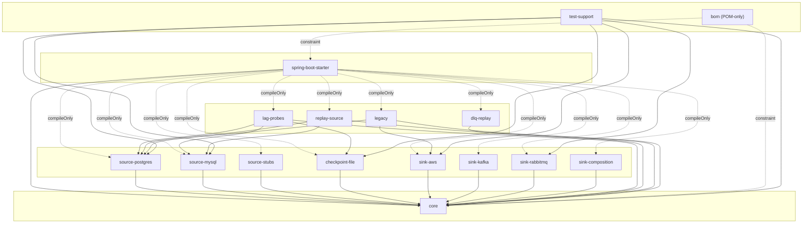
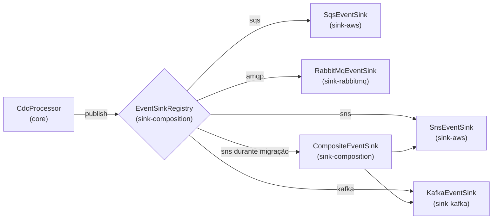
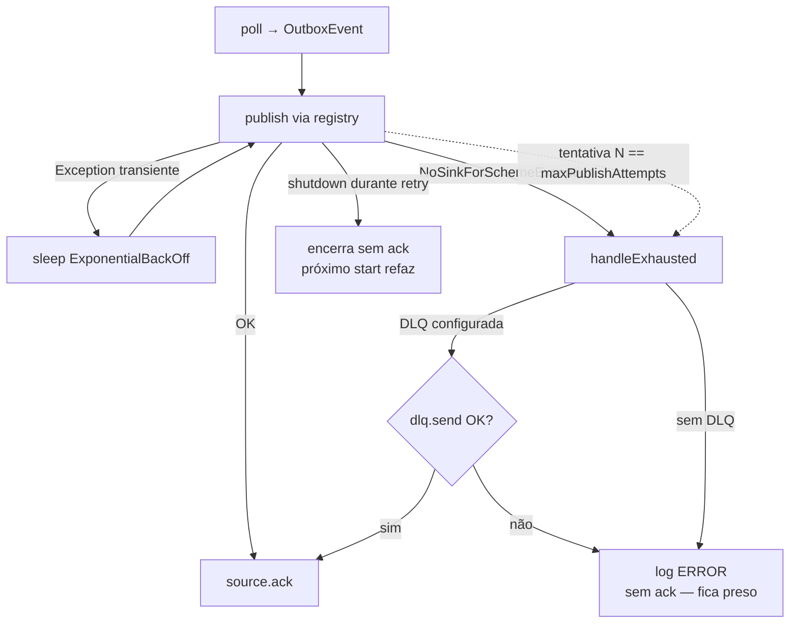

# Arquitetura — `cdc-outbox-event-producer`

> Documento técnico complementar ao [README](../README.md). O README dá
> a visão executiva (o que o producer faz, como rodar, configuração);
> este arquivo entra no detalhe de cada porta, adaptador e máquina de
> estado. Mantenha os dois em sincronia — quando uma porta ganha um
> método ou um adaptador muda de contrato, atualize aqui também.

---

## Sumário

1. [Stack e premissas](#stack-e-premissas)
2. [Mapa do código (hexagonal)](#mapa-do-código-hexagonal)
3. [Domínio (`core/domain`)](#domínio-coredomain)
4. [Portas (`core/port`)](#portas-coreport)
5. [Núcleo de aplicação (`core/application`)](#núcleo-de-aplicação-coreapplication)
6. [Adaptadores de origem](#adaptadores-de-origem)
7. [Adaptadores de destino](#adaptadores-de-destino)
8. [Adaptador de dead-letter legado](#adaptador-de-dead-letter-legado)
9. [Máquina de estado de retry + DLQ](#máquina-de-estado-de-retry--dlq)
10. [Sequência: fluxo MySQL binlog → Kafka](#sequência-fluxo-mysql-binlog--kafka)
11. [Catálogo de propriedades (`cdc.outbox.*`)](#catálogo-de-propriedades-cdcoutbox)
12. [Auto-configurações e ordem de wiring](#auto-configurações-e-ordem-de-wiring)
13. [Observabilidade](#observabilidade)
14. [Contratos de threading](#contratos-de-threading)
15. [Garantias de entrega](#garantias-de-entrega)
16. [Convivência com o pipeline legado](#convivência-com-o-pipeline-legado)

---

## Stack e premissas

  * Kotlin **2.3.21** sobre JVM **21** (baseline mínimo do próprio
    Spring Boot 4; antes era JVM 17).
  * Spring Boot **4.0.6** / Spring Framework **7.0.7** (dependências em
    `compileOnly` — o JAR roda fora do Boot).
  * Spring Cloud AWS **4.0.2** (`SnsTemplate` / `SqsTemplate`, AWS SDK v2).
  * `pgjdbc` 42.6 (replicação lógica), `mysql-binlog-connector-java`
    0.29.2 (binlog), HikariCP 7.0.2, Micrometer 1.16.5, Testcontainers 1.21.4.
  * O núcleo (`core/`) compila **sem** Spring e **sem** drivers JDBC.

A separação hexagonal é um princípio: domínio e portas em `core`,
adaptadores em módulos `source-*` / `sink-*` / `checkpoint-*` /
`lag-probes` / `dlq-replay` / `replay-source`, infraestrutura Spring
em `spring-boot-starter`. A **divisão por módulos Gradle entrou na
Onda 6** (item 11 da roadmap, Round 12) e na **Wave 7** (Round 17)
cada módulo virou uma coordenada Maven própria, com um BOM
(`cdc-outbox-bom`) pinando versões.

## Mapa do código (hexagonal)

15 módulos Gradle + 1 BOM. Cada um publica `cdc-outbox-<módulo>`
(Wave 7); `core` no fundo, adapters em volta, `spring-boot-starter`
no topo amarrando tudo via auto-config.

```
cdc-outbox-event-producer/
├── core/                                  ← núcleo puro, zero framework deps
│   ├── domain/   OutboxEvent, Routing, RowChange, TableMapping
│   ├── port/     CdcSource, RowChangeSource (driving)
│   │             EventSink, EventSinkRegistry, DeadLetterPort,
│   │             MappingRules, CheckpointStore, LagProbe,
│   │             SourceReplayer (driven)
│   └── application/  CdcProcessor, MappingCdcSource, DefaultMappingRules
│
├── source-postgres/                       ← Wave 6
│   ├── adapter/source/postgres/PgLogicalReplicationCdcSource.kt
│   ├── adapter/source/postgres/PgWalRowChangeSource.kt        (Onda 5.2)
│   └── replication/                       ← infra Postgres (slot, parser wal2json, pool)
│       ├── config/{Postgres,Replication}Configuration.kt
│       ├── connector/{Postgres,Default,HikariCP}Connector.kt
│       └── strategy/ByteToClassParser*.kt  + model/{Slot,Message,Insert,Update,Delete}*.kt
│
├── source-mysql/                          ← Wave 6
│   ├── adapter/source/mysql/MySqlOutboxTableCdcSource.kt
│   └── adapter/source/mysql/MySqlBinlogRowChangeSource.kt
│
├── source-stubs/                          ← Wave 6
│   ├── adapter/source/sqlserver/SqlServerCdcSourceStub.kt     (placeholder)
│   └── adapter/source/oracle/OracleCdcSourceStub.kt           (placeholder)
│
├── sink-aws/                              ← Wave 6
│   ├── adapter/sink/sns/SnsEventSink.kt
│   ├── adapter/sink/sqs/SqsEventSink.kt
│   └── aws/sns,sqs/                       ← producers SCA 3 (Sns/SqsTemplate)
│
├── sink-kafka/                            ← Wave 6
│   └── adapter/sink/kafka/KafkaEventSink.kt
│
├── sink-rabbitmq/                         ← Wave 6
│   └── adapter/sink/rabbitmq/RabbitMqEventSink.kt
│
├── sink-composition/                      ← Wave 6
│   ├── adapter/sink/composite/CompositeEventSink.kt
│   ├── adapter/sink/router/SchemeRouterEventSink.kt
│   └── adapter/sink/registry/DefaultEventSinkRegistry.kt
│
├── checkpoint-file/                       ← Onda 5.2
│   └── adapter/checkpoint/FileCheckpointStore.kt
│
├── lag-probes/                            ← Round 10
│   ├── adapter/lag/postgres/PostgresLagProbe.kt
│   ├── adapter/lag/mysql/MysqlLagProbe.kt
│   └── observability/LagProbeScheduler.kt
│
├── dlq-replay/                            ← Round 14
│   └── adapter actuator/cdcOutboxDlq    (peek/replay/abandon)
│
├── replay-source/                         ← Round 15
│   ├── adapter actuator/cdcOutboxReplay
│   ├── replay/MySqlBinlogReplayer.kt
│   └── replay/PgWalReplayerStub.kt
│
├── legacy/                                ← chain pré-Onda 5 (opt-in)
│   ├── workflow/SlotReaderMessageProducer.kt + SlotReaderCallback + DestinationType
│   ├── deadletter/{DeadLetterSink, SqsDeadLetterSink}
│   └── adapter/deadletter/LegacyDeadLetterPortAdapter.kt
│
├── spring-boot-starter/                   ← único módulo que conhece a superfície
│   └── infra/spring/                      ← auto-configurações Spring Boot
│       ├── CdcOutboxAutoConfiguration.kt
│       ├── CdcOutboxHexagonalAutoConfiguration.kt
│       ├── CdcOutboxSinkAutoConfiguration.kt
│       ├── CdcOutboxMappingAutoConfiguration.kt
│       ├── CdcOutboxHealthAutoConfiguration.kt
│       ├── CdcOutboxProperties.kt
│       ├── CdcOutboxLifecycle.kt          (legado, ativo com processor.kind=LEGACY)
│       ├── CdcProcessorLifecycle.kt       (hex)
│       ├── CdcOutboxHealthIndicator.kt    (legado)
│       └── CdcProcessorHealthIndicator.kt (hex)
│
├── test-support/                          ← fixtures compartilhadas (só testImplementation)
│   ├── E2EContainers, IntegrationBase
│   ├── InMemoryCheckpointStore (test double)
│   └── configuration mothers
│
└── bom/                                   ← Wave 7 — POM-only, pina versões
```

Regras invioláveis (enforçadas no build graph desde Wave 6):

  * `core` é Kotlin puro — não importa Spring, drivers, broker
    templates, AWS SDK.
  * Adaptadores podem depender de `core`. O caminho contrário é
    interdição arquitetural — quebra de hexágono.
  * Spring (anotações `@Bean`, `@Conditional*`, `@ConfigurationProperties`,
    `SmartLifecycle`, `HealthIndicator`) só vive em `spring-boot-starter`.
  * Cada adapter declara seu driver/template como `compileOnly` — o
    consumidor traz a versão.



> Diagrama hexagonal de containers e sequência feliz Postgres → SNS
> vivem no [README](../README.md#diagrama-hexagonal); aqui ficam o
> sequence MySQL binlog → Kafka e a máquina de estado de retry+DLQ.

## Domínio (`core/domain`)

### `OutboxEvent`

[OutboxEvent.kt](../core/src/main/kotlin/br/com/fltech/outbox/publisher/core/domain/OutboxEvent.kt)
é o único tipo que atravessa a fronteira do hexágono. Imutável,
serializável, value-type real (`equals`/`hashCode` sobre o array de
bytes via `contentEquals` — o `data class` default compararia o
`payload` por referência).

| Campo              | Tipo                  | Significado                                                                  |
|--------------------|-----------------------|------------------------------------------------------------------------------|
| `id`               | `String`              | Identidade dentro do escopo da origem (LSN, GTID, PK). Devolvido em `ack`.   |
| `routing`          | `Routing`             | Para onde publicar (scheme + target + atributos).                            |
| `payload`          | `ByteArray`           | Conteúdo opaco — adaptadores decidem encoding.                               |
| `occurredAt`       | `Instant`             | Timestamp do commit upstream (não do read).                                  |
| `sourceCheckpoint` | `String`              | Marcador opaco usado pela origem para confirmar progresso (LSN, GTID, ...). |
| `headers`          | `Map<String, String>` | Atributos a propagar para o broker.                                          |

### `Routing`

[Routing.kt](../core/src/main/kotlin/br/com/fltech/outbox/publisher/core/domain/Routing.kt).
Tripla `(scheme, target, attributes)`:

  * `scheme` em minúsculo (`sns`, `sqs`, `kafka`, `amqp`) — é o que o
    `EventSinkRegistry` usa para resolver o sink.
  * `target` específico do broker (tópico SNS, queue SQS, tópico Kafka,
    `exchange/routingKey` AMQP).
  * `Routing.parse("sns://orders.events")` é a forma URI canônica.
  * `Routing.parsePrefix(...)` aceita ainda a forma legada
    `SNS|orders.events` e o prefixo nu (default scheme = `sns`) — herança
    do projeto-origem.

### `RowChange`

[RowChange.kt](../core/src/main/kotlin/br/com/fltech/outbox/publisher/core/domain/RowChange.kt)
representa um evento I/U/D antes de virar `OutboxEvent`. Usado pelas
origens row-level (MySQL binlog, futuro Postgres I/U/D). Contém:

  * `op: Op` — `INSERT | UPDATE | DELETE`.
  * `table: String` — FQN (ex.: `public.orders`).
  * `sourceCheckpoint: String` — LSN, GTID ou `<binlog>:<position>`.
  * `occurredAt: Instant`.
  * `before`/`after: Map<String, Any?>` — payload bruto JDBC.

### `TableMapping`

[TableMapping.kt](../core/src/main/kotlin/br/com/fltech/outbox/publisher/core/domain/TableMapping.kt)
é a especificação declarativa do item 7 da brief (mapeamento flexível
de tabela / coluna / sink). Cinco blocos:

  * `capture: Set<Op>` — quais operações repassar.
  * `key`: `columns` + `format` (template `{col}`) — chave/PK do evento.
  * `payload`: `include` XOR `exclude`, `rename` aplicado depois.
  * `eventType`: template `{table}.{op}` por default (op → created /
    updated / deleted).
  * `routing`: `sink: "scheme://target"` (validado no `init`) +
    `attributes` (com substituição `{col}`).

## Portas (`core/port`)

### Driving — `CdcSource`

[CdcSource.kt](../core/src/main/kotlin/br/com/fltech/outbox/publisher/core/port/CdcSource.kt).
Porta de **alto nível** — entrega `OutboxEvent` direto ao orquestrador.

```kotlin
interface CdcSource : AutoCloseable {
    fun open()
    fun poll(): OutboxEvent?     // não-bloqueante; null = idle
    fun ack(event: OutboxEvent)  // idempotente
    override fun close()
}
```

Contrato de threading: **uma thread por instância**. `poll`/`ack`/`close`
não podem ser chamados concorrentemente. Implementações que mantêm
estado por chamada (cursor JDBC com `FOR UPDATE`) dependem disso.

Contrato de `ack`: o source DEVE avançar o checkpoint pra além do evento.
Idempotente. Out-of-order é permitido (cada implementação decide a
política de consolidação).

### Driving — `RowChangeSource`

[RowChangeSource.kt](../core/src/main/kotlin/br/com/fltech/outbox/publisher/core/port/RowChangeSource.kt).
Versão de **baixo nível** que entrega `RowChange`. Existe pra que o
mapeamento declarativo possa rodar entre a origem row-level e o
orquestrador. O decorator [`MappingCdcSource`](#núcleo-de-aplicação-coreapplication)
casa uma `RowChangeSource` com uma `MappingRules` e satisfaz a
`CdcSource`.

### Driven — `EventSink`

[EventSink.kt](../core/src/main/kotlin/br/com/fltech/outbox/publisher/core/port/EventSink.kt).
`fun interface EventSink { fun publish(routing: Routing, event: OutboxEvent) }`.
Cada sink é responsável por **um** scheme. Falhas permanentes devem
ser lançadas — retry é responsabilidade do orquestrador, não do sink.

### Driven — `EventSinkRegistry`

[EventSinkRegistry.kt](../core/src/main/kotlin/br/com/fltech/outbox/publisher/core/port/EventSinkRegistry.kt).
Resolução `scheme → EventSink`. Implementação default em
[DefaultEventSinkRegistry](../sink-composition/src/main/kotlin/br/com/fltech/outbox/publisher/adapter/sink/registry/DefaultEventSinkRegistry.kt)
case-insensitive. `publish()` lança `NoSinkForSchemeException` quando
não há sink — o orquestrador trata isso como falha permanente (sem
retry) e direciona pra DLQ se houver.

### Driven — `DeadLetterPort`

[DeadLetterPort.kt](../core/src/main/kotlin/br/com/fltech/outbox/publisher/core/port/DeadLetterPort.kt).
`fun interface DeadLetterPort { fun send(event: OutboxEvent, cause: Throwable) }`.
Recebe um evento que esgotou retries. Adaptador legado em
[LegacyDeadLetterPortAdapter](../legacy/src/main/kotlin/br/com/fltech/outbox/publisher/adapter/deadletter/LegacyDeadLetterPortAdapter.kt)
faz a ponte para o `DeadLetterSink` legado (envelope SQS) — assim
quem já tinha `SqsDeadLetterSink` configurado mantém a configuração.

### Driven — `MappingRules`

[MappingRules.kt](../core/src/main/kotlin/br/com/fltech/outbox/publisher/core/port/MappingRules.kt).
`fun interface MappingRules { fun map(rowChange: RowChange): OutboxEvent? }`.
Retorna `null` quando não há mapeamento para a tabela ou quando a op
está fora do `capture` — `MappingCdcSource` então faz `ack` na origem
e drop silencioso no orquestrador.

### Driven — `CheckpointStore`

[CheckpointStore.kt](../core/src/main/kotlin/br/com/fltech/outbox/publisher/core/port/CheckpointStore.kt)
(Onda 5.2). `interface CheckpointStore : AutoCloseable { fun load(key: String): String?; fun save(key: String, value: String) }`.
Persiste marcadores opacos por origem (`"binlog:<serverId>"`,
`"pg-wal:<slotName>"`). Invariantes contratuais: `save` é atômico
(crash mid-save nunca deixa valor corrompido); `load` tolera
corrupção devolvendo `null` + WARN, deixando o source cair na
posição natural. Chamado na thread única do orquestrador. Opcional —
sources aceitam `CheckpointStore?` e mantêm o comportamento
in-memory quando `null`.

### Driven — `LagProbe`

[LagProbe.kt](../core/src/main/kotlin/br/com/fltech/outbox/publisher/core/port/LagProbe.kt)
(Round 10 follow-up). `interface LagProbe { val sourceLabel: String; fun lagBytes(): Long? }`.
Reporta o lag de replicação em bytes (quanto a origem está atrás
da cabeça do WAL/binlog upstream). Retorna `null` quando a
medição é temporariamente indisponível (rotação de binlog,
falha de consulta) — o gauge expõe isso como `Double.NaN`. O
`sourceLabel` é o valor da tag `source` do gauge. Chamado pelo
`LagProbeScheduler` numa cadência mais lenta que o scrape do
Micrometer; o resultado é parqueado num `AtomicLong` e lido
pelo gauge a custo zero.

## Núcleo de aplicação (`core/application`)

### `CdcProcessor`

[CdcProcessor.kt](../core/src/main/kotlin/br/com/fltech/outbox/publisher/core/application/CdcProcessor.kt).
O orquestrador hexagonal. Loop bloqueante de única thread (a thread é
fornecida pelo `CdcProcessorLifecycle`, daemon). Pseudocódigo:

```kotlin
while (running) {
    val event = source.poll() ?: { sleep(idle); continue }
    metrics.recordMessageRead(slotLabel)
    processEvent(event)
}

fun processEvent(event) {
    var attempt = 0
    while (attempt < maxPublishAttempts && running) {
        attempt++
        try {
            sinkRegistry.publish(event.routing, event)
            source.ack(event)
            return
        } catch (e: NoSinkForSchemeException) {
            handleExhausted(event, e); return  // sem retry — erro de config
        } catch (e: Exception) {
            sleep(publishBackOff.nextDelay(attempt))
        }
    }
    handleExhausted(event, lastException)
}

fun handleExhausted(event, cause) {
    val dlq = deadLetterPort ?: { log.error(...); return }  // sem DLQ → fica preso
    try { dlq.send(event, cause); source.ack(event) }
    catch (e) { log.error(...); /* não dá ack */ }
}
```

Invariantes:

  * `source.ack(event)` chamado **uma única vez** por evento e **só**
    depois de publish OK ou dead-letter OK.
  * Em shutdown durante retry, o evento **não** vai pra DLQ. O processor
    encerra sem `ack`, garantindo que o próximo start refaça a entrega.
  * `running` é `@Volatile` → `stop()` de outra thread é observado
    no próximo ciclo.
  * Exceções de configuração (`NoSinkForSchemeException`) são tratadas
    como permanentes — sem retry, vão direto pra DLQ (ou ficam presas
    se não houver).

### `MappingCdcSource`

[MappingCdcSource.kt](../core/src/main/kotlin/br/com/fltech/outbox/publisher/core/application/MappingCdcSource.kt).
Decorator que satisfaz `CdcSource` lendo de uma `RowChangeSource` e
aplicando `MappingRules`. Mantém um buffer
`event.sourceCheckpoint → RowChange` para que `ack(event)` possa
recuperar a row original e propagar o ack para baixo. Single-threaded
por contrato — o mapa não precisa de sincronização.

### `DefaultMappingRules`

[DefaultMappingRules.kt](../core/src/main/kotlin/br/com/fltech/outbox/publisher/core/application/DefaultMappingRules.kt).
Implementação de referência. Para cada `RowChange`:

  1. Resolve por igualdade exata de `table` (case-sensitive).
  2. Filtra por `mapping.capture` (drop silencioso se op não está
     incluída).
  3. Escolhe o snapshot (`after` para INSERT/UPDATE, `before` para
     DELETE).
  4. Deriva `id` via template `{col}` ou join com `|`.
  5. Projeta payload (`include` XOR `exclude`, depois `rename`).
  6. Formata `eventType` substituindo `{table}` e `{op}`.
  7. Parseia `routing.sink` em `Routing` e aplica substituição nos
     atributos.
  8. Serializa o map projetado via `serializer` (Jackson quando
     disponível, fallback `k=v`).

## Adaptadores de origem

### `PgLogicalReplicationCdcSource`

[PgLogicalReplicationCdcSource.kt](../source-postgres/src/main/kotlin/br/com/fltech/outbox/publisher/adapter/source/postgres/PgLogicalReplicationCdcSource.kt).
Embrulha `PostgresConnector` (legado) com a interface `CdcSource`.

  * `poll()`: lê próximo `ByteBuffer` do slot lógico, faz parse via
    `ByteToClassParserImplV1/V2`, mantém só `MessageChange` (M
    records) — I/U/D ficam para o `PgWalRowChangeSource` (Onda 5.2)
    quando o consumidor opta pelo fluxo row-level.
  * LSN resolvido a partir do campo embedded `lsn` quando
    `include-lsn=true`; fallback para `lastReceivedLsn` se o campo for
    inválido.
  * `ack(event)`: parseia `event.sourceCheckpoint` como
    `LogSequenceNumber` e chama `setStreamLsn`.

### `MySqlOutboxTableCdcSource`

[MySqlOutboxTableCdcSource.kt](../source-mysql/src/main/kotlin/br/com/fltech/outbox/publisher/adapter/source/mysql/MySqlOutboxTableCdcSource.kt).
Variante poller — tabela `outbox_events` (schema fixo documentado no
KDoc) consumida com `SELECT … FOR UPDATE SKIP LOCKED`. `poll()` abre
transação, retorna a row mais antiga não publicada; `ack` faz
`UPDATE outbox_events SET published_at = NOW()` + commit + close.
Nome da tabela validado contra `[A-Za-z_][A-Za-z0-9_]*` (mitigação
de SQLi).

### `MySqlBinlogRowChangeSource`

[MySqlBinlogRowChangeSource.kt](../source-mysql/src/main/kotlin/br/com/fltech/outbox/publisher/adapter/source/mysql/MySqlBinlogRowChangeSource.kt).
Origem row-level via `mysql-binlog-connector-java`. Implementa
`RowChangeSource`, não `CdcSource` — é o `MappingCdcSource` quem casa
a porta com o `MappingRules` configurado.

  * Conexão assíncrona: cliente roda em thread própria (daemon
    `cdc-outbox-mysql-binlog`), eventos vão para `LinkedBlockingQueue`
    (capacidade 1024) com back-pressure. `poll()` drena 1 evento.
  * Manipula `ROTATE` (atualiza arquivo binlog atual), `TABLE_MAP`
    (cache `tableId → schema.table`), `WRITE_ROWS` / `UPDATE_ROWS` /
    `DELETE_ROWS` (emite `RowChange`).
  * Checkpoint `<binlog filename>:<EventHeaderV4.nextPosition>`.
  * **Wave 5.2:** `CheckpointStore?` opcional. Em `open()` carrega
    `"binlog:<serverId>"` e — se válido `<file>:<pos>` — programa o
    cliente via `setBinlogFilename`/`setBinlogPosition`. Em cada
    `ack` persiste o novo `<file>:<nextPosition>` (erro de `save` é
    WARN; o checkpoint in-memory continua). Sem store: comportamento
    histórico (resume do head). Também invalida o cache de nomes de
    coluna quando um `TABLE_MAP` reporta `columnCount` diferente do
    já visto para o `tableId` — sinal de `ALTER TABLE`; o próximo
    lookup re-consulta INFORMATION_SCHEMA.

### `PgWalRowChangeSource`

[PgWalRowChangeSource.kt](../source-postgres/src/main/kotlin/br/com/fltech/outbox/publisher/adapter/source/postgres/PgWalRowChangeSource.kt)
(Onda 5.2). Origem row-level Postgres — irmã do binlog MySQL no
hexágono. Implementa `RowChangeSource`, reaproveita
`PostgresConnector` + `wal2json` do `PgLogicalReplicationCdcSource`,
mas consome `I`/`U`/`D` em vez de `M`. Coexiste com o adapter
message-only (slots distintos; auto-config garante exclusividade).

  * `I` → `RowChange(op=INSERT, after=columns)`. `U` →
    `RowChange(op=UPDATE, before=identity, after=columns)` (identity
    = replica-identity, geralmente PK; columns = post-image). `D` →
    `RowChange(op=DELETE, before=identity)`. `M` records são
    silenciosamente ignorados.
  * Checkpoint: LSN textual (`LogSequenceNumber.asString()`). `ack`
    chama `setStreamLsn(lsn)` no slot e — se um `CheckpointStore`
    foi injetado — persiste sob `"pg-wal:<slotName>"`. Postgres já
    persiste `confirmed_flush_lsn` server-side, então o store é
    informativo (diagnóstico + paridade com o fluxo MySQL).
  * Buffer `ArrayDeque<RowChange>` interno acomoda chunks wal2json V1
    em lote sem perder records.
  * Os parsers (`ByteToClassParserImplV2` default, V1 fallback) foram
    estendidos para surfacer `schema`/`table`/`columns`/`identity`
    em `SlotMessageV2` + `Wal2JsonColumn`; o fluxo message-only não
    muda graças a `@JsonIgnoreProperties(ignoreUnknown=true)`. O
    `ByteToClassParserImplV1` ganhou a mesma paridade no Round 10:
    zipa os arrays paralelos `columnnames` / `columntypes` /
    `columnvalues` (e `oldkeys.keynames` / `keytypes` / `keyvalues`
    em `U` / `D`) em `List<Wal2JsonColumn>`, propaga o
    `nextlsn` do envelope para cada child `Change`, e preserva o
    caminho `pg_logical_emit_message` (kind=`message`) que o IT
    `format_v1 - without type` exercita.

### `SqlServerCdcSourceStub` / `OracleCdcSourceStub`

[SqlServerCdcSourceStub.kt](../source-stubs/src/main/kotlin/br/com/fltech/outbox/publisher/adapter/source/sqlserver/SqlServerCdcSourceStub.kt)
e [OracleCdcSourceStub.kt](../source-stubs/src/main/kotlin/br/com/fltech/outbox/publisher/adapter/source/oracle/OracleCdcSourceStub.kt).
Placeholders. `open`/`poll`/`ack` lançam `UnsupportedOperationException`
deliberadamente — instalação errada falha alto e cedo, em vez de não
emitir nada. Implementação real fica para uma onda futura.

## Adaptadores de destino

| Adapter                                                                                                                                                  | Scheme  | Template usado            | Versão               |
|----------------------------------------------------------------------------------------------------------------------------------------------------------|---------|---------------------------|----------------------|
| [SnsEventSink](../sink-aws/src/main/kotlin/br/com/fltech/outbox/publisher/adapter/sink/sns/SnsEventSink.kt)                                                    | `sns`   | `SnsTemplate` (SCA 3)     | AWS SDK v2 (2.27.x)  |
| [SqsEventSink](../sink-aws/src/main/kotlin/br/com/fltech/outbox/publisher/adapter/sink/sqs/SqsEventSink.kt)                                                    | `sqs`   | `SqsTemplate` (SCA 3)     | AWS SDK v2 (2.27.x)  |
| [KafkaEventSink](../sink-kafka/src/main/kotlin/br/com/fltech/outbox/publisher/adapter/sink/kafka/KafkaEventSink.kt)                                              | `kafka` | `KafkaTemplate<String,ByteArray>` (Spring Kafka) | kafka-clients atual |
| [RabbitMqEventSink](../sink-rabbitmq/src/main/kotlin/br/com/fltech/outbox/publisher/adapter/sink/rabbitmq/RabbitMqEventSink.kt)                                     | `amqp`  | `RabbitTemplate` (Spring AMQP) | Spring AMQP        |
| [CompositeEventSink](../sink-composition/src/main/kotlin/br/com/fltech/outbox/publisher/adapter/sink/composite/CompositeEventSink.kt)                                  | —       | fan-out de N delegates    | —                    |
| [SchemeRouterEventSink](../sink-composition/src/main/kotlin/br/com/fltech/outbox/publisher/adapter/sink/router/SchemeRouterEventSink.kt)                               | —       | re-roteia via registry    | —                    |

Detalhes operacionais:

  * **SNS**: payload UTF-8 via `convertAndSend(target, body, attributes)`.
    `target` é o nome do tópico; `attributes = event.headers + routing.attributes`
    com `routing.attributes` ganhando em colisão.
  * **SQS**: `sqsTemplate.send { queue(target).payload(body).headers(attrs) }`.
  * **Kafka**: `event.id` vira a record key (garante ordering por chave
    no consumer). Publish é bloqueante (`send().get()`) — o
    `CompletableFuture` default da Spring Kafka esconderia falhas do
    orquestrador.
  * **RabbitMQ**: `routing.target` é `exchange/routingKey` (uma `/`
    separa). Sem slash, publish vai pra default exchange usando o
    `target` como routing key (= nome da queue). `messageId =
    event.id` ajuda dedup downstream.
  * **Composite**: dois modos — `failFast=true` (default, primeiro
    throw aborta), `failFast=false` (tenta todos, re-throw o primeiro
    no fim com `addSuppressed`). Útil em migração entre brokers
    (dual-write).
  * **SchemeRouter**: caso raro de pipeline em que o composite precisa
    decidir o sink por evento — re-entra no registry.

### Composição de sinks

`EventSinkRegistry` + `CompositeEventSink` + `SchemeRouterEventSink`
moram em **sink-composition**; cada leaf sink mora no seu próprio
módulo (`sink-aws`, `sink-kafka`, `sink-rabbitmq`).



## Adaptador de dead-letter legado

[LegacyDeadLetterPortAdapter](../legacy/src/main/kotlin/br/com/fltech/outbox/publisher/adapter/deadletter/LegacyDeadLetterPortAdapter.kt)
implementa `DeadLetterPort` em cima de
[DeadLetterSink](../legacy/src/main/kotlin/br/com/fltech/outbox/publisher/deadletter/DeadLetterSink.kt)
(API legada `(lsn, MessageChange, Throwable)`). Reconstrói os dois
parâmetros a partir do `OutboxEvent` para que a publicação em
[SqsDeadLetterSink](../legacy/src/main/kotlin/br/com/fltech/outbox/publisher/deadletter/SqsDeadLetterSink.kt)
gere o envelope SQS já documentado. Esse adaptador é exatamente o tipo
de "tradutor" que justifica a separação domínio/adapter — ele conhece
`LogSequenceNumber` e `MessageChange` porque vive no anel adaptador.

## Adaptador de checkpoint file-backed

[FileCheckpointStore.kt](../checkpoint-file/src/main/kotlin/br/com/fltech/outbox/publisher/adapter/checkpoint/FileCheckpointStore.kt)
(Onda 5.2). Implementação default de `CheckpointStore`: um arquivo
JSON (`{"key":"…","value":"…"}`, hand-written para não puxar Jackson
num leaf adapter) por `key` em `<directory>/<sanitised-key>.json`.

`save` é atômico em três passos: (1) escreve `<key>.json.tmp`; (2)
`FileChannel.force(true)` (fsync) antes do rename; (3)
`Files.move(tmp, canonical, ATOMIC_MOVE | REPLACE_EXISTING)`.
Filesystems sem atomic-move (mounts de rede) caem para
`REPLACE_EXISTING` puro com WARN. `load` tolera corrupção devolvendo
`null` + WARN, deixando o arquivo em disco para inspeção. Wiring:
registrado quando `cdc.outbox.checkpoint.enabled=true` e nenhum
`CheckpointStore` concorrente existe. `cdc.outbox.checkpoint.directory`
deve apontar para um volume durável.

**Crash-recovery sweep (Round 10).** O construtor varre o diretório
e remove qualquer `<key>.json.tmp` deixado por um crash entre o
`Files.write` e o `ATOMIC_MOVE`. Cada entrada incrementa
`cdc.outbox.checkpoint.orphans_swept{outcome=deleted|failed}`. A
varredura é eager-on-construct (não num `init()` separado) porque
mantém a call-site `FileCheckpointStore(directory, metrics)` única
e libera o teste de observar o estado pós-sweep diretamente — sem
fixtures extras. O bean factory em `CdcOutboxHexagonalAutoConfiguration`
injeta o `CdcOutboxMetrics` do contexto para que o counter saia do
noop em produção (Round 10 follow-up; antes dessa wiring o counter
ficava na facade vazia).

## Adaptador de lag-probe

Tres componentes formam a cadeia de exposição do lag de replicação
como gauge Micrometer (Round 10 follow-up; resolve o item (a) do
roadmap row 12).

  * [PostgresLagProbe.kt](../lag-probes/src/main/kotlin/br/com/fltech/outbox/publisher/adapter/lag/postgres/PostgresLagProbe.kt).
    Consulta
    `SELECT pg_wal_lsn_diff(pg_current_wal_lsn(), confirmed_flush_lsn) FROM pg_replication_slots WHERE slot_name = ?`.
    Diferencia `confirmed_flush_lsn` SQL `NULL` (slot definido mas
    nunca streamed) de zero-byte lag via `wasNull()`. `SQLException`
    → WARN + `null`.
  * [MysqlLagProbe.kt](../lag-probes/src/main/kotlin/br/com/fltech/outbox/publisher/adapter/lag/mysql/MysqlLagProbe.kt).
    Consulta `SHOW MASTER STATUS` para o `(File, Position)` corrente
    do servidor, lê a posição persistida em `CheckpointStore` sob
    `"binlog:<serverId>"` e calcula `serverPosition − checkpointPosition`
    quando os files batem. File divergente (binlog rotacionou
    além do checkpoint) → `null` + INFO uma única vez (debounce via
    `AtomicBoolean`) — branch conservador; estimar via tamanhos de
    binlog rotacionados é frágil quando o servidor já fez `PURGE`.
  * [LagProbeScheduler.kt](../lag-probes/src/main/kotlin/br/com/fltech/outbox/publisher/observability/LagProbeScheduler.kt).
    `ScheduledExecutorService` daemon (não usa `@Scheduled` para
    manter o producer agnóstico ao Spring Scheduling). Amostra
    `LagProbe.lagBytes()` no intervalo `cdc.outbox.lag.interval`,
    parqueia o `Long` num `AtomicLong` com sentinel `Long.MIN_VALUE`
    para "sem amostra". O gauge registrado em `CdcOutboxMetrics`
    via `registerLagGauge(sourceLabel) { … }` lê do cache; sentinel
    é traduzido para `Double.NaN` (Prometheus convenciona NaN como
    "no data").

Wiring em `CdcOutboxHexagonalAutoConfiguration`: três beans
condicionais, gated por `cdc.outbox.lag.enabled=true` (default) +
`@ConditionalOnMissingBean(LagProbe::class)` + `@ConditionalOnBean`
do source concreto (`PgWalRowChangeSource` ou
`MySqlBinlogRowChangeSource`). Consumidores que quiserem outra
implementação registram um `LagProbe` próprio e o autoconfig respeita.
`MySqlBinlogRowChangeSource.serverId` virou `val` público no Round 10
exatamente para o probe poder montar a key de checkpoint sem ler
properties duplicadas.

## Máquina de estado de retry + DLQ



Pontos não óbvios:

  * `NoSinkForSchemeException` é tratada como permanente — retentar
    com a config errada só queima tempo.
  * Falha no `dlq.send` **não** ack o source. O próximo ciclo
    tenta publicar de novo no broker primário; se voltar OK, o evento
    sai sem precisar de intervenção. Se continuar quebrando, vai
    re-tentar a DLQ.
  * Shutdown mid-retry preserva at-least-once: o source fica sem ack,
    o próximo start replaya. Não vai pra DLQ porque o operador pode
    estar fazendo manutenção planejada.

## Sequência: fluxo MySQL binlog → Kafka

```mermaid
sequenceDiagram
    autonumber
    participant App as Aplicação consumidora
    participant MY as MySQL
    participant Cli as BinaryLogClient<br/>(source-mysql)
    participant Row as MySqlBinlogRowChangeSource<br/>(source-mysql)
    participant Map as MappingCdcSource<br/>(core)
    participant Proc as CdcProcessor<br/>(core)
    participant Kfk as KafkaEventSink<br/>(sink-kafka)
    participant K as Kafka
    participant Ckp as FileCheckpointStore<br/>(checkpoint-file)

    App->>MY: BEGIN; INSERT orders; COMMIT
    MY-->>Cli: WRITE_ROWS event
    Cli->>Row: handleEvent(WRITE_ROWS)
    Row->>Row: build RowChange(op=INSERT)
    Row->>Row: buffer.put(rowChange) -- back-pressure
    Proc->>Map: poll()
    Map->>Row: poll()
    Row-->>Map: RowChange
    Map->>Map: mappingRules.map(rowChange)
    Note over Map: aplica TableMapping
    Map-->>Proc: OutboxEvent(routing=kafka://orders)
    Proc->>Kfk: publish(routing, event)
    Kfk->>K: send(record).get()
    K-->>Kfk: ack
    Kfk-->>Proc: return
    Proc->>Map: ack(event)
    Map->>Row: ack(rowChange)
    Row->>Row: lastAckedCheckpoint = file:pos
    Row->>Ckp: save(binlog:serverId, file:pos)
```

> Legenda: `Ckp` representa o `CheckpointStore` opcional (Onda 5.2,
> módulo `checkpoint-file` quando file-backed). Quando o consumidor
> não declara nenhum `CheckpointStore`, o ramo final é elidido —
> comportamento histórico in-memory.

## Catálogo de propriedades (`cdc.outbox.*`)

Fonte canônica: [CdcOutboxProperties.kt](../spring-boot-starter/src/main/kotlin/br/com/fltech/outbox/publisher/infra/spring/CdcOutboxProperties.kt).

### Geral

| Propriedade               | Default      | Significado                                          |
|---------------------------|--------------|------------------------------------------------------|
| `cdc.outbox.enabled`      | `true`       | Master switch das auto-configs.                      |
| `cdc.outbox.processor.kind` | `HEXAGONAL` | `HEXAGONAL` (default desde Onda 5) ou `LEGACY`.     |

### `cdc.outbox.postgres.*`

| Propriedade           | Default       | Significado                            |
|-----------------------|---------------|----------------------------------------|
| `host`                | `localhost`   |                                        |
| `port`                | `5432`        |                                        |
| `database`            | `postgres`    |                                        |
| `username`            | `postgres`    | Precisa de `REPLICATION` + `LOGIN`.    |
| `password`            | `""`          |                                        |
| `sslMode`             | `disable`     | `disable|require|verify-ca|verify-full` |
| `pathToRootCert`      | `null`        | CA bundle para `verify-*`.             |
| `pathToSslCert` / `pathToSslKey` / `sslPassword` | `null` | mTLS / passphrase. |

### `cdc.outbox.replication.*`

| Propriedade                    | Default          | Significado                                    |
|--------------------------------|------------------|------------------------------------------------|
| `slotName`                     | `cdc_outbox_slot`| Nome do slot lógico (snake_case, ≤ 63).         |
| `outputPlugin`                 | `wal2json`       | Plugin de saída.                                |
| `statusInterval`               | `20s`            | Keep-alive para o Postgres.                     |
| `updateIdleSlotInterval`       | `5m`             | Force-flush em idle.                            |
| `existingProcessRetryLimit`    | `30`             | Retries se outro reader pegou o slot.           |
| `existingProcessRetrySleep`    | `30s`            | Sleep entre os retries.                         |
| `includeXids`                  | `true`           | wal2json: incluir transaction ids.              |
| `includeLsn`                   | `true`           | wal2json: incluir LSN por record.               |
| `formatVersion`                | `V2`             | wal2json format-version.                        |

### `cdc.outbox.pool.*`

Hikari para a connection regular (a streaming connection é `DriverManager`
puro — Postgres exige conexão crua para `replication=database`).

| Propriedade               | Default                   |
|---------------------------|---------------------------|
| `maximumPoolSize`         | `2`                       |
| `minimumIdle`             | `0`                       |
| `connectionTimeout`       | `5s`                      |
| `validationTimeout`       | `3s`                      |
| `idleTimeout`             | `5m`                      |
| `maxLifetime`             | `30m`                     |
| `leakDetectionThreshold`  | `30s`                     |
| `poolName`                | `cdc-outbox-query-pool`   |
| `keepaliveTime`           | `0` (desligado — HikariCP 7 mudou o próprio default pra 2min; Round 21 fixou desligado, Round 23 tornou configurável) |
| `autoCommit`              | `true`                    |

### `cdc.outbox.retry.*`

| Propriedade                | Default | Significado                                  |
|----------------------------|---------|----------------------------------------------|
| `initial`                  | `200ms` | Backoff inicial para reconnect.              |
| `max`                      | `30s`   | Cap do backoff de reconnect.                 |
| `multiplier`               | `2.0`   | Crescimento exponencial.                     |
| `jitter`                   | `0.3`   | Full jitter `[1-j, 1+j]`.                    |
| `maxReconnectAttempts`     | `30`    | Cap de tentativas de reconexão.              |
| `maxPublishAttempts`       | `5`     | Tentativas de publish por mensagem (incl. 1ª). |
| `publishBackoffInitial`    | `100ms` | Backoff inicial entre retries de publish.    |
| `publishBackoffMax`        | `5s`    | Cap do backoff de publish.                   |

### `cdc.outbox.health.*`

| Propriedade  | Default | Significado                                                 |
|--------------|---------|-------------------------------------------------------------|
| `max-idle`   | `10m`   | Indicador legado vira `OUT_OF_SERVICE` após esse tempo.     |

### `cdc.outbox.checkpoint.*`

| Propriedade  | Default                    | Significado                                                                   |
|--------------|----------------------------|-------------------------------------------------------------------------------|
| `enabled`    | `false`                    | Liga o `FileCheckpointStore` default. Onda 5.2.                               |
| `directory`  | `.cdc-outbox-checkpoints`  | Diretório onde o store escreve `<sanitised-key>.json`. Operadores devem apontar para volume durável. |

### `cdc.outbox.lag.*`

| Propriedade  | Default  | Significado                                                                  |
|--------------|----------|------------------------------------------------------------------------------|
| `enabled`    | `true`   | Liga o `LagProbeScheduler`. Round 10 follow-up.                              |
| `interval`   | `PT10S`  | Intervalo de amostragem do `LagProbe` (gauge `cdc.outbox.source.lag_bytes`). |

### `cdc.outbox.dead-letter.*`

| Propriedade   | Default | Significado                                                          |
|---------------|---------|----------------------------------------------------------------------|
| `queueName`   | `null`  | Nome/ARN da queue SQS para DLQ. Sem isso, retry exausto fica preso. |

### `cdc.outbox.mappings`

Lista de `MappingProps` (Onda 3.5 / item 7 da brief). Esquema completo
em [TableMapping.kt](../core/src/main/kotlin/br/com/fltech/outbox/publisher/core/domain/TableMapping.kt)
e exemplo YAML no [README](../README.md).

## Auto-configurações e ordem de wiring

O módulo `spring-boot-starter` registra cinco auto-configs no
`META-INF/spring/org.springframework.boot.autoconfigure.AutoConfiguration.imports`
(mais auto-configs específicas dos módulos opt-in `dlq-replay` e
`replay-source`, que ficam no classpath só se o consumidor declarou a
coordenada Maven correspondente):

| Auto-config                          | Responsabilidade                                                                            |
|--------------------------------------|---------------------------------------------------------------------------------------------|
| `CdcOutboxAutoConfiguration`         | Beans base (`PostgresConfiguration`, `ReplicationConfiguration`, `ConnectionProvider`, `CdcOutboxMetrics`, `BackOff` reconnect/publish, DLQ legada) + `SlotReaderMessageProducer` + lifecycle legado (apenas com `processor.kind=legacy`). |
| `CdcOutboxHexagonalAutoConfiguration`| `CdcSource` (resolve `MappingCdcSource(RowChangeSource, MappingRules)` quando há bean `RowChangeSource` — binlog MySQL ou `PgWalRowChangeSource`; fallback para `PgLogicalReplicationCdcSource`), `CdcProcessor`, `CdcProcessorLifecycle`, `DeadLetterPort` (adapter do legado quando há `DeadLetterSink`), `CheckpointStore` default (`FileCheckpointStore`) quando `cdc.outbox.checkpoint.enabled=true` e nenhum bean concorrente foi declarado. Ativa com `processor.kind=hexagonal` (default desde Onda 5, `matchIfMissing=true`). |
| `CdcOutboxSinkAutoConfiguration`     | Um `EventSink` por broker (`sns`/`sqs`/`kafka`/`amqp`), cada um gated por `@ConditionalOnClass` + `@ConditionalOnBean` do template. Monta `DefaultEventSinkRegistry` com o que estiver presente. |
| `CdcOutboxMappingAutoConfiguration`  | Traduz `cdc.outbox.mappings` em `DefaultMappingRules` (Jackson opcional via `ObjectProvider<ObjectMapper>`). |
| `CdcOutboxHealthAutoConfiguration`   | Indicador Actuator (dois branches mutuamente exclusivos: legado `CdcOutboxHealthIndicator` × hex `CdcProcessorHealthIndicator`). |

Ordem: `Auto → Sink → Hexagonal → Mapping → Health` (via
`@AutoConfigureAfter`).

## Observabilidade

[CdcOutboxMetrics](../core/src/main/kotlin/br/com/fltech/outbox/publisher/observability/CdcOutboxMetrics.kt)
é uma façade Micrometer no-op-friendly (sem `MeterRegistry` na
aplicação, todos os métodos viram no-ops).

| Métrica                                 | Tipo    | Tags                          | Quando incrementa                                |
|-----------------------------------------|---------|-------------------------------|--------------------------------------------------|
| `cdc.outbox.messages.read`              | counter | `slot`                        | A cada record lido.                              |
| `cdc.outbox.messages.published`         | counter | `sink`, `topic`               | A cada publish OK.                               |
| `cdc.outbox.messages.failed`            | counter | `sink`, `topic`, `cause`      | A cada publish que falhou (cada tentativa).      |
| `cdc.outbox.messages.discarded`         | counter | `reason`                      | Records descartados (não-message, etc.).         |
| `cdc.outbox.publish.duration`           | timer   | `sink`                        | Latência fim-a-fim do publish.                   |
| `cdc.outbox.publish.retries`            | counter | `sink`, `topic`, `attempt`    | A cada retry (não conta a 1ª).                   |
| `cdc.outbox.reconnect.attempts`         | counter | `reason`                      | Toda vez que o loop reconecta.                   |
| `cdc.outbox.messages.dead_lettered`     | counter | `sink`, `topic`, `cause`      | A cada DLQ OK.                                   |
| `cdc.outbox.dead_letter.failures`       | counter | `cause`                       | A cada DLQ que falhou — operador deve agir.      |
| `cdc.outbox.source.binlog.parse_errors` | counter | `cause`                       | A cada evento binlog que levantou na thread do listener (Onda 5.1). |
| `cdc.outbox.source.binlog.column_resolution.fallbacks` | counter | `table`            | Toda vez que o `MySqlBinlogRowChangeSource` caiu para `col0/col1/…` em vez do nome real (DataSource ausente, INFORMATION_SCHEMA vazio ou lookup raised) (Onda 5.1). |

Health: `/actuator/health` mostra `cdcOutboxHealthIndicator`. Path
legado (`CdcOutboxHealthIndicator`): `slot`, `running`,
`lifecycleRunning`, `pendingFailureLsn`, `idleFor`. Path hex
(`CdcProcessorHealthIndicator`): `slot`, `processorRunning`,
`lifecycleRunning`, `pendingFailureCheckpoint` (Onda 5.2; `"none"`
quando ausente), `idleFor`, `maxIdle`. Precedência das transições no
hex: `pendingFailureCheckpoint != null` (`DOWN`) > lifecycle parada
(`DOWN`) > loop não iterando (`DOWN`) > idle além de
`cdc.outbox.health.max-idle` (`OUT_OF_SERVICE`) > `UP`. Paridade
funcional com o indicador legado entregue na Onda 5.2.

Lag upstream (slot Postgres, binlog MySQL) é exposto como gauge
`cdc.outbox.source.lag_bytes{source=postgres|mysql}` pelo módulo
opt-in **lag-probes** (Round 10): `PostgresLagProbe` +
`MysqlLagProbe` + `LagProbeScheduler` (daemon `ScheduledExecutorService`,
intervalo `cdc.outbox.lag.interval`). Valor `Double.NaN` quando ainda
não há amostra ou a consulta falha temporariamente. Detalhe na seção
[Adaptador de lag-probe](#adaptador-de-lag-probe).

## Contratos de threading

| Componente                       | Thread                                       |
|----------------------------------|----------------------------------------------|
| `CdcProcessor.start()` (loop)    | uma thread daemon (`cdc-outbox-processor`) do `CdcProcessorLifecycle` |
| `CdcSource.poll/ack/close`       | mesma thread do loop — single-thread por instância |
| `MySqlBinlogRowChangeSource` cliente | thread interna `cdc-outbox-mysql-binlog` (daemon) — só popula a fila |
| `EventSink.publish`              | thread do loop (síncrono)                    |
| `DeadLetterPort.send`            | thread do loop (síncrono)                    |
| `CheckpointStore.load/save`      | thread do loop (síncrono, single-thread)     |

`@Volatile` aparece em `running` (loop), `inflightConn`/`inflightId`
(MySQL poller — para `close` em thread diferente), `currentBinlogFile`
e `lastAckedCheckpoint` (binlog). `AtomicBoolean` / `AtomicReference` /
`ConcurrentHashMap` no binlog source porque a fronteira cliente
binlog ↔ poller é multi-thread.

## Garantias de entrega

At-least-once. Invariantes auditáveis a cada PR:

  1. O checkpoint da origem só avança **depois** de publish OK ou
     dead-letter OK.
  2. Em falha de publish, retry com backoff. Esgotado o limite → DLQ
     (se configurada) → ack. Sem DLQ → fica preso (operador intervém).
     `cdc.outbox.dead_letter.failures` é o alarme.
  3. Em shutdown durante retry, encerra sem ack — replay no próximo
     start. **Não** vai pra DLQ (operador pode estar fazendo
     manutenção).
  4. Em `NoSinkForSchemeException` → trata como permanente (sem retry)
     → DLQ ou stuck.

Duplicatas downstream são consequência aceita do contrato — consumers
devem dedup por `event.id`.

## Convivência com o pipeline legado

O `SlotReaderMessageProducer`
([workflow/SlotReaderMessageProducer.kt](../legacy/src/main/kotlin/br/com/fltech/outbox/publisher/workflow/SlotReaderMessageProducer.kt))
continua sendo o pipeline ativado por `cdc.outbox.processor.kind=legacy`.
Os dois ciclos são mutuamente exclusivos via `@ConditionalOnProperty`,
então não há risco de streaming-threads concorrentes. A Onda 5.2 fecha
a paridade funcional do hex com o legado (checkpoint persistido +
`pendingFailureCheckpoint`); a remoção da chain legada fica para uma
onda posterior, enquanto existirem deployments antigos.

---

Última atualização: 2026-05 (após Round 19 — NF4 Mermaid diagrams
refresh para refletir Wave 6 multi-módulo + Wave 7 multi-artifact +
módulos DLQ/source-replay/lag-probes).
