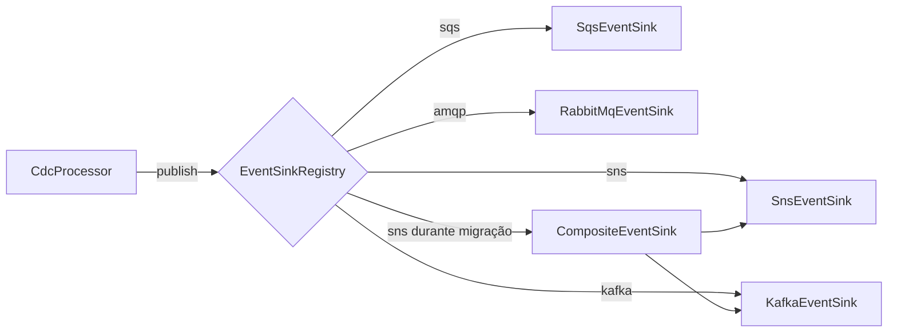
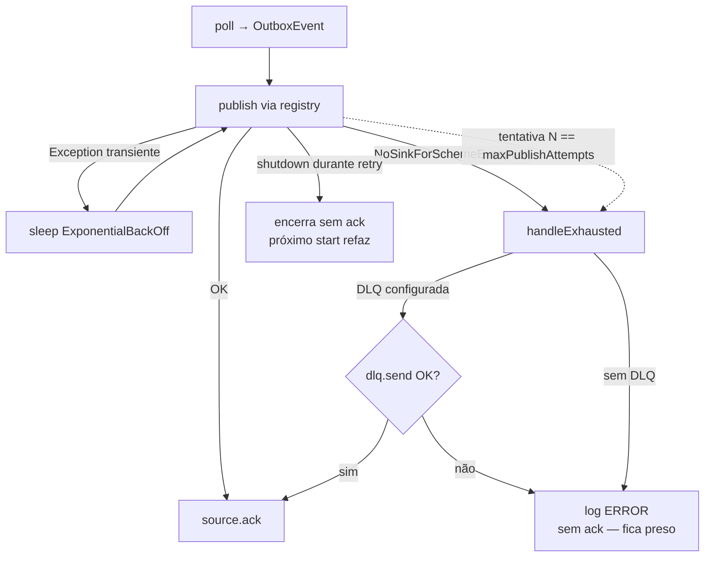

# Arquitetura — `cdc-outbox-event-producer`

> Documento técnico complementar ao [README](../README.md). O README dá
> a visão executiva (o que o producer faz, como rodar, configuração);
> este arquivo entra no detalhe de cada porta, adaptador e máquina de
> estado. Mantenha os dois em sincronia — quando uma porta ganha um
> método ou um adaptador muda de contrato, atualize aqui também.

---

## Sumário

1. [Stack e premissas](#stack-e-premissas)
2. [Mapa do código (hexagonal)](#mapa-do-código-hexagonal)
3. [Domínio (`core/domain`)](#domínio-coredomain)
4. [Portas (`core/port`)](#portas-coreport)
5. [Núcleo de aplicação (`core/application`)](#núcleo-de-aplicação-coreapplication)
6. [Adaptadores de origem](#adaptadores-de-origem)
7. [Adaptadores de destino](#adaptadores-de-destino)
8. [Adaptador de dead-letter legado](#adaptador-de-dead-letter-legado)
9. [Máquina de estado de retry + DLQ](#máquina-de-estado-de-retry--dlq)
10. [Sequência: fluxo MySQL binlog → Kafka](#sequência-fluxo-mysql-binlog--kafka)
11. [Catálogo de propriedades (`cdc.outbox.*`)](#catálogo-de-propriedades-cdcoutbox)
12. [Auto-configurações e ordem de wiring](#auto-configurações-e-ordem-de-wiring)
13. [Observabilidade](#observabilidade)
14. [Contratos de threading](#contratos-de-threading)
15. [Garantias de entrega](#garantias-de-entrega)
16. [Convivência com o pipeline legado](#convivência-com-o-pipeline-legado)

---

## Stack e premissas

  * Kotlin **1.9.25** sobre JVM 17 (compilado com JDK 21).
  * Spring Boot **3.3.5** (dependências em `compileOnly` — o JAR roda
    fora do Boot).
  * Spring Cloud AWS **3.2.1** (`SnsTemplate` / `SqsTemplate`, AWS SDK v2).
  * `pgjdbc` 42.6 (replicação lógica), `mysql-binlog-connector-java`
    0.29.2 (binlog), HikariCP 5.1, Micrometer 1.12, Testcontainers 1.20.
  * O núcleo (`core/`) compila **sem** Spring e **sem** drivers JDBC.

A separação hexagonal é um princípio: domínio e portas em `core/`,
adaptadores em `adapter/`, infraestrutura Spring em `infra/spring/`. A
divisão por módulos Gradle entra na Onda 5.1 / 6.

## Mapa do código (hexagonal)

```
src/main/kotlin/br/com/fltech/cdc/outbox/publisher/
├── core/                                      ← núcleo puro (sem Spring, sem drivers)
│   ├── domain/                                ← tipos de valor
│   │   ├── OutboxEvent.kt
│   │   ├── Routing.kt
│   │   ├── RowChange.kt
│   │   └── TableMapping.kt
│   ├── port/                                  ← interfaces puras
│   │   ├── CdcSource.kt              (driving — origem alto-nível)
│   │   ├── RowChangeSource.kt        (driving — origem row-level)
│   │   ├── EventSink.kt              (driven — destino broker)
│   │   ├── EventSinkRegistry.kt      (driven — resolução por scheme)
│   │   ├── DeadLetterPort.kt         (driven — DLQ hexagonal)
│   │   └── MappingRules.kt           (driven — projeção RowChange→OutboxEvent)
│   └── application/                           ← orquestração
│       ├── CdcProcessor.kt           (loop hexagonal + retry + DLQ)
│       ├── MappingCdcSource.kt       (decorator RowChangeSource → CdcSource)
│       └── DefaultMappingRules.kt    (motor de TableMapping)
│
├── adapter/                                   ← anel adaptador
│   ├── source/
│   │   ├── postgres/PgLogicalReplicationCdcSource.kt
│   │   ├── mysql/MySqlOutboxTableCdcSource.kt
│   │   ├── mysql/MySqlBinlogRowChangeSource.kt
│   │   ├── sqlserver/SqlServerCdcSourceStub.kt        (Onda 5.2+)
│   │   └── oracle/OracleCdcSourceStub.kt              (Onda 5.2+)
│   ├── sink/
│   │   ├── sns/SnsEventSink.kt
│   │   ├── sqs/SqsEventSink.kt
│   │   ├── kafka/KafkaEventSink.kt
│   │   ├── rabbitmq/RabbitMqEventSink.kt
│   │   ├── composite/CompositeEventSink.kt
│   │   ├── router/SchemeRouterEventSink.kt
│   │   └── registry/DefaultEventSinkRegistry.kt
│   └── deadletter/LegacyDeadLetterPortAdapter.kt
│
├── infra/spring/                              ← auto-configurações Spring Boot
│   ├── CdcOutboxAutoConfiguration.kt
│   ├── CdcOutboxHexagonalAutoConfiguration.kt
│   ├── CdcOutboxSinkAutoConfiguration.kt
│   ├── CdcOutboxMappingAutoConfiguration.kt
│   ├── CdcOutboxHealthAutoConfiguration.kt
│   ├── CdcOutboxProperties.kt
│   ├── CdcOutboxLifecycle.kt              (legado)
│   ├── CdcProcessorLifecycle.kt           (hex)
│   ├── CdcOutboxHealthIndicator.kt        (legado)
│   └── CdcProcessorHealthIndicator.kt     (hex)
│
├── workflow/                                  ← orquestrador legado (chain pré-Onda 3)
│   ├── SlotReaderMessageProducer.kt
│   ├── SlotReaderCallback.kt
│   └── DestinationType.kt
│
├── replication/                               ← infraestrutura Postgres (slot, parser, pool)
│   ├── config/{Postgres,Replication}Configuration.kt
│   ├── connector/{Postgres,Default,HikariCP}Connector.kt
│   ├── strategy/ByteToClassParser*.kt
│   └── model/{Slot,Message,Insert,Update,Delete}*.kt
│
├── aws/sns,sqs/                               ← producers SCA 3 (`Sns/SqsTemplate`)
├── deadletter/                                ← `DeadLetterSink` legado + `SqsDeadLetterSink`
├── retry/BackOff.kt                           ← `ExponentialBackOff` + interface
├── observability/CdcOutboxMetrics.kt          ← façade Micrometer
└── helper, jackson, ...
```

Regras invioláveis:

  * Nada em `core/` importa de `adapter/`, `infra/`, `workflow/`,
    `aws/`, `replication/` (drivers).
  * Adaptadores podem importar de `core/`. O caminho contrário é
    interdição arquitetural — quebra de hexágono.
  * Spring (anotações `@Bean`, `@Conditional*`, `@ConfigurationProperties`)
    aparece **apenas** em `infra/spring/`.

> Diagrama hexagonal de containers e sequência feliz Postgres → SNS
> vivem no [README](../README.md#diagrama-hexagonal); aqui ficam o
> sequence MySQL binlog → Kafka e a máquina de estado de retry+DLQ.

## Domínio (`core/domain`)

### `OutboxEvent`

[OutboxEvent.kt](../src/main/kotlin/br/com/fltech/cdc/outbox/publisher/core/domain/OutboxEvent.kt)
é o único tipo que atravessa a fronteira do hexágono. Imutável,
serializável, value-type real (`equals`/`hashCode` sobre o array de
bytes via `contentEquals` — o `data class` default compararia o
`payload` por referência).

| Campo              | Tipo                  | Significado                                                                  |
|--------------------|-----------------------|------------------------------------------------------------------------------|
| `id`               | `String`              | Identidade dentro do escopo da origem (LSN, GTID, PK). Devolvido em `ack`.   |
| `routing`          | `Routing`             | Para onde publicar (scheme + target + atributos).                            |
| `payload`          | `ByteArray`           | Conteúdo opaco — adaptadores decidem encoding.                               |
| `occurredAt`       | `Instant`             | Timestamp do commit upstream (não do read).                                  |
| `sourceCheckpoint` | `String`              | Marcador opaco usado pela origem para confirmar progresso (LSN, GTID, ...). |
| `headers`          | `Map<String, String>` | Atributos a propagar para o broker.                                          |

### `Routing`

[Routing.kt](../src/main/kotlin/br/com/fltech/cdc/outbox/publisher/core/domain/Routing.kt).
Tripla `(scheme, target, attributes)`:

  * `scheme` em minúsculo (`sns`, `sqs`, `kafka`, `amqp`) — é o que o
    `EventSinkRegistry` usa para resolver o sink.
  * `target` específico do broker (tópico SNS, queue SQS, tópico Kafka,
    `exchange/routingKey` AMQP).
  * `Routing.parse("sns://orders.events")` é a forma URI canônica.
  * `Routing.parsePrefix(...)` aceita ainda a forma legada
    `SNS|orders.events` e o prefixo nu (default scheme = `sns`) — herança
    do projeto-origem.

### `RowChange`

[RowChange.kt](../src/main/kotlin/br/com/fltech/cdc/outbox/publisher/core/domain/RowChange.kt)
representa um evento I/U/D antes de virar `OutboxEvent`. Usado pelas
origens row-level (MySQL binlog, futuro Postgres I/U/D). Contém:

  * `op: Op` — `INSERT | UPDATE | DELETE`.
  * `table: String` — FQN (ex.: `public.orders`).
  * `sourceCheckpoint: String` — LSN, GTID ou `<binlog>:<position>`.
  * `occurredAt: Instant`.
  * `before`/`after: Map<String, Any?>` — payload bruto JDBC.

### `TableMapping`

[TableMapping.kt](../src/main/kotlin/br/com/fltech/cdc/outbox/publisher/core/domain/TableMapping.kt)
é a especificação declarativa do item 7 da brief (mapeamento flexível
de tabela / coluna / sink). Cinco blocos:

  * `capture: Set<Op>` — quais operações repassar.
  * `key`: `columns` + `format` (template `{col}`) — chave/PK do evento.
  * `payload`: `include` XOR `exclude`, `rename` aplicado depois.
  * `eventType`: template `{table}.{op}` por default (op → created /
    updated / deleted).
  * `routing`: `sink: "scheme://target"` (validado no `init`) +
    `attributes` (com substituição `{col}`).

## Portas (`core/port`)

### Driving — `CdcSource`

[CdcSource.kt](../src/main/kotlin/br/com/fltech/cdc/outbox/publisher/core/port/CdcSource.kt).
Porta de **alto nível** — entrega `OutboxEvent` direto ao orquestrador.

```kotlin
interface CdcSource : AutoCloseable {
    fun open()
    fun poll(): OutboxEvent?     // não-bloqueante; null = idle
    fun ack(event: OutboxEvent)  // idempotente
    override fun close()
}
```

Contrato de threading: **uma thread por instância**. `poll`/`ack`/`close`
não podem ser chamados concorrentemente. Implementações que mantêm
estado por chamada (cursor JDBC com `FOR UPDATE`) dependem disso.

Contrato de `ack`: o source DEVE avançar o checkpoint pra além do evento.
Idempotente. Out-of-order é permitido (cada implementação decide a
política de consolidação).

### Driving — `RowChangeSource`

[RowChangeSource.kt](../src/main/kotlin/br/com/fltech/cdc/outbox/publisher/core/port/RowChangeSource.kt).
Versão de **baixo nível** que entrega `RowChange`. Existe pra que o
mapeamento declarativo possa rodar entre a origem row-level e o
orquestrador. O decorator [`MappingCdcSource`](#núcleo-de-aplicação-coreapplication)
casa uma `RowChangeSource` com uma `MappingRules` e satisfaz a
`CdcSource`.

### Driven — `EventSink`

[EventSink.kt](../src/main/kotlin/br/com/fltech/cdc/outbox/publisher/core/port/EventSink.kt).
`fun interface EventSink { fun publish(routing: Routing, event: OutboxEvent) }`.
Cada sink é responsável por **um** scheme. Falhas permanentes devem
ser lançadas — retry é responsabilidade do orquestrador, não do sink.

### Driven — `EventSinkRegistry`

[EventSinkRegistry.kt](../src/main/kotlin/br/com/fltech/cdc/outbox/publisher/core/port/EventSinkRegistry.kt).
Resolução `scheme → EventSink`. Implementação default em
[DefaultEventSinkRegistry](../src/main/kotlin/br/com/fltech/cdc/outbox/publisher/adapter/sink/registry/DefaultEventSinkRegistry.kt)
case-insensitive. `publish()` lança `NoSinkForSchemeException` quando
não há sink — o orquestrador trata isso como falha permanente (sem
retry) e direciona pra DLQ se houver.

### Driven — `DeadLetterPort`

[DeadLetterPort.kt](../src/main/kotlin/br/com/fltech/cdc/outbox/publisher/core/port/DeadLetterPort.kt).
`fun interface DeadLetterPort { fun send(event: OutboxEvent, cause: Throwable) }`.
Recebe um evento que esgotou retries. Adaptador legado em
[LegacyDeadLetterPortAdapter](../src/main/kotlin/br/com/fltech/cdc/outbox/publisher/adapter/deadletter/LegacyDeadLetterPortAdapter.kt)
faz a ponte para o `DeadLetterSink` legado (envelope SQS) — assim
quem já tinha `SqsDeadLetterSink` configurado mantém a configuração.

### Driven — `MappingRules`

[MappingRules.kt](../src/main/kotlin/br/com/fltech/cdc/outbox/publisher/core/port/MappingRules.kt).
`fun interface MappingRules { fun map(rowChange: RowChange): OutboxEvent? }`.
Retorna `null` quando não há mapeamento para a tabela ou quando a op
está fora do `capture` — `MappingCdcSource` então faz `ack` na origem
e drop silencioso no orquestrador.

## Núcleo de aplicação (`core/application`)

### `CdcProcessor`

[CdcProcessor.kt](../src/main/kotlin/br/com/fltech/cdc/outbox/publisher/core/application/CdcProcessor.kt).
O orquestrador hexagonal. Loop bloqueante de única thread (a thread é
fornecida pelo `CdcProcessorLifecycle`, daemon). Pseudocódigo:

```kotlin
while (running) {
    val event = source.poll() ?: { sleep(idle); continue }
    metrics.recordMessageRead(slotLabel)
    processEvent(event)
}

fun processEvent(event) {
    var attempt = 0
    while (attempt < maxPublishAttempts && running) {
        attempt++
        try {
            sinkRegistry.publish(event.routing, event)
            source.ack(event)
            return
        } catch (e: NoSinkForSchemeException) {
            handleExhausted(event, e); return  // sem retry — erro de config
        } catch (e: Exception) {
            sleep(publishBackOff.nextDelay(attempt))
        }
    }
    handleExhausted(event, lastException)
}

fun handleExhausted(event, cause) {
    val dlq = deadLetterPort ?: { log.error(...); return }  // sem DLQ → fica preso
    try { dlq.send(event, cause); source.ack(event) }
    catch (e) { log.error(...); /* não dá ack */ }
}
```

Invariantes:

  * `source.ack(event)` chamado **uma única vez** por evento e **só**
    depois de publish OK ou dead-letter OK.
  * Em shutdown durante retry, o evento **não** vai pra DLQ. O processor
    encerra sem `ack`, garantindo que o próximo start refaça a entrega.
  * `running` é `@Volatile` → `stop()` de outra thread é observado
    no próximo ciclo.
  * Exceções de configuração (`NoSinkForSchemeException`) são tratadas
    como permanentes — sem retry, vão direto pra DLQ (ou ficam presas
    se não houver).

### `MappingCdcSource`

[MappingCdcSource.kt](../src/main/kotlin/br/com/fltech/cdc/outbox/publisher/core/application/MappingCdcSource.kt).
Decorator que satisfaz `CdcSource` lendo de uma `RowChangeSource` e
aplicando `MappingRules`. Mantém um buffer
`event.sourceCheckpoint → RowChange` para que `ack(event)` possa
recuperar a row original e propagar o ack para baixo. Single-threaded
por contrato — o mapa não precisa de sincronização.

### `DefaultMappingRules`

[DefaultMappingRules.kt](../src/main/kotlin/br/com/fltech/cdc/outbox/publisher/core/application/DefaultMappingRules.kt).
Implementação de referência. Para cada `RowChange`:

  1. Resolve por igualdade exata de `table` (case-sensitive).
  2. Filtra por `mapping.capture` (drop silencioso se op não está
     incluída).
  3. Escolhe o snapshot (`after` para INSERT/UPDATE, `before` para
     DELETE).
  4. Deriva `id` via template `{col}` ou join com `|`.
  5. Projeta payload (`include` XOR `exclude`, depois `rename`).
  6. Formata `eventType` substituindo `{table}` e `{op}`.
  7. Parseia `routing.sink` em `Routing` e aplica substituição nos
     atributos.
  8. Serializa o map projetado via `serializer` (Jackson quando
     disponível, fallback `k=v`).

## Adaptadores de origem

### `PgLogicalReplicationCdcSource`

[PgLogicalReplicationCdcSource.kt](../src/main/kotlin/br/com/fltech/cdc/outbox/publisher/adapter/source/postgres/PgLogicalReplicationCdcSource.kt).
Embrulha `PostgresConnector` (legado) com a interface `CdcSource`.

  * `poll()`: lê próximo `ByteBuffer` do slot lógico, faz parse via
    `ByteToClassParserImplV1/V2`, mantém só `MessageChange` (M
    records) — I/U/D são silenciosamente ignorados nesse adapter (o
    source row-level do Postgres entra na Onda 5.1/6).
  * LSN resolvido a partir do campo embedded `lsn` quando
    `include-lsn=true`; fallback para `lastReceivedLsn` se o campo for
    inválido.
  * `ack(event)`: parseia `event.sourceCheckpoint` como
    `LogSequenceNumber` e chama `setStreamLsn`.

### `MySqlOutboxTableCdcSource`

[MySqlOutboxTableCdcSource.kt](../src/main/kotlin/br/com/fltech/cdc/outbox/publisher/adapter/source/mysql/MySqlOutboxTableCdcSource.kt).
Variante poller — tabela `outbox_events` (schema fixo documentado no
KDoc) consumida com `SELECT … FOR UPDATE SKIP LOCKED`. `poll()` abre
transação, retorna a row mais antiga não publicada; `ack` faz
`UPDATE outbox_events SET published_at = NOW()` + commit + close.
Nome da tabela validado contra `[A-Za-z_][A-Za-z0-9_]*` (mitigação
de SQLi).

### `MySqlBinlogRowChangeSource`

[MySqlBinlogRowChangeSource.kt](../src/main/kotlin/br/com/fltech/cdc/outbox/publisher/adapter/source/mysql/MySqlBinlogRowChangeSource.kt).
Origem row-level via `mysql-binlog-connector-java`. Implementa
`RowChangeSource`, não `CdcSource` — é o `MappingCdcSource` quem casa
a porta com o `MappingRules` configurado.

  * Conexão assíncrona: cliente roda em thread própria (daemon
    `cdc-outbox-mysql-binlog`), eventos vão para `LinkedBlockingQueue`
    (capacidade 1024) com back-pressure. `poll()` drena 1 evento.
  * Manipula `ROTATE` (atualiza arquivo binlog atual), `TABLE_MAP`
    (cache `tableId → schema.table`), `WRITE_ROWS` / `UPDATE_ROWS` /
    `DELETE_ROWS` (emite `RowChange`).
  * Checkpoint `<binlog filename>:<EventHeaderV4.nextPosition>`.
  * Limitações conhecidas (rastreadas pela Onda 5.1):
      - colunas expostas como `col0`/`col1`/… até o lookup em
        `INFORMATION_SCHEMA` entrar;
      - `lastAckedCheckpoint` só em memória — sem resume persistido;
      - IT MySQL com Testcontainers ainda não escrito.

### `SqlServerCdcSourceStub` / `OracleCdcSourceStub`

[SqlServerCdcSourceStub.kt](../src/main/kotlin/br/com/fltech/cdc/outbox/publisher/adapter/source/sqlserver/SqlServerCdcSourceStub.kt)
e [OracleCdcSourceStub.kt](../src/main/kotlin/br/com/fltech/cdc/outbox/publisher/adapter/source/oracle/OracleCdcSourceStub.kt).
Placeholders. `open`/`poll`/`ack` lançam `UnsupportedOperationException`
deliberadamente — instalação errada falha alto e cedo, em vez de não
emitir nada. Implementação real vai na Onda 5.2+.

## Adaptadores de destino

| Adapter                                                                                                                                                  | Scheme  | Template usado            | Versão               |
|----------------------------------------------------------------------------------------------------------------------------------------------------------|---------|---------------------------|----------------------|
| [SnsEventSink](../src/main/kotlin/br/com/fltech/cdc/outbox/publisher/adapter/sink/sns/SnsEventSink.kt)                                                    | `sns`   | `SnsTemplate` (SCA 3)     | AWS SDK v2 (2.27.x)  |
| [SqsEventSink](../src/main/kotlin/br/com/fltech/cdc/outbox/publisher/adapter/sink/sqs/SqsEventSink.kt)                                                    | `sqs`   | `SqsTemplate` (SCA 3)     | AWS SDK v2 (2.27.x)  |
| [KafkaEventSink](../src/main/kotlin/br/com/fltech/cdc/outbox/publisher/adapter/sink/kafka/KafkaEventSink.kt)                                              | `kafka` | `KafkaTemplate<String,ByteArray>` (Spring Kafka) | kafka-clients atual |
| [RabbitMqEventSink](../src/main/kotlin/br/com/fltech/cdc/outbox/publisher/adapter/sink/rabbitmq/RabbitMqEventSink.kt)                                     | `amqp`  | `RabbitTemplate` (Spring AMQP) | Spring AMQP        |
| [CompositeEventSink](../src/main/kotlin/br/com/fltech/cdc/outbox/publisher/adapter/sink/composite/CompositeEventSink.kt)                                  | —       | fan-out de N delegates    | —                    |
| [SchemeRouterEventSink](../src/main/kotlin/br/com/fltech/cdc/outbox/publisher/adapter/sink/router/SchemeRouterEventSink.kt)                               | —       | re-roteia via registry    | —                    |

Detalhes operacionais:

  * **SNS**: payload UTF-8 via `convertAndSend(target, body, attributes)`.
    `target` é o nome do tópico; `attributes = event.headers + routing.attributes`
    com `routing.attributes` ganhando em colisão.
  * **SQS**: `sqsTemplate.send { queue(target).payload(body).headers(attrs) }`.
  * **Kafka**: `event.id` vira a record key (garante ordering por chave
    no consumer). Publish é bloqueante (`send().get()`) — o
    `CompletableFuture` default da Spring Kafka esconderia falhas do
    orquestrador.
  * **RabbitMQ**: `routing.target` é `exchange/routingKey` (uma `/`
    separa). Sem slash, publish vai pra default exchange usando o
    `target` como routing key (= nome da queue). `messageId =
    event.id` ajuda dedup downstream.
  * **Composite**: dois modos — `failFast=true` (default, primeiro
    throw aborta), `failFast=false` (tenta todos, re-throw o primeiro
    no fim com `addSuppressed`). Útil em migração entre brokers
    (dual-write).
  * **SchemeRouter**: caso raro de pipeline em que o composite precisa
    decidir o sink por evento — re-entra no registry.

### Composição de sinks



## Adaptador de dead-letter legado

[LegacyDeadLetterPortAdapter](../src/main/kotlin/br/com/fltech/cdc/outbox/publisher/adapter/deadletter/LegacyDeadLetterPortAdapter.kt)
implementa `DeadLetterPort` em cima de
[DeadLetterSink](../src/main/kotlin/br/com/fltech/cdc/outbox/publisher/deadletter/DeadLetterSink.kt)
(API legada `(lsn, MessageChange, Throwable)`). Reconstrói os dois
parâmetros a partir do `OutboxEvent` para que a publicação em
[SqsDeadLetterSink](../src/main/kotlin/br/com/fltech/cdc/outbox/publisher/deadletter/SqsDeadLetterSink.kt)
gere o envelope SQS já documentado. Esse adaptador é exatamente o tipo
de "tradutor" que justifica a separação domínio/adapter — ele conhece
`LogSequenceNumber` e `MessageChange` porque vive no anel adaptador.

## Máquina de estado de retry + DLQ



Pontos não óbvios:

  * `NoSinkForSchemeException` é tratada como permanente — retentar
    com a config errada só queima tempo.
  * Falha no `dlq.send` **não** ack o source. O próximo ciclo
    tenta publicar de novo no broker primário; se voltar OK, o evento
    sai sem precisar de intervenção. Se continuar quebrando, vai
    re-tentar a DLQ.
  * Shutdown mid-retry preserva at-least-once: o source fica sem ack,
    o próximo start replaya. Não vai pra DLQ porque o operador pode
    estar fazendo manutenção planejada.

## Sequência: fluxo MySQL binlog → Kafka

```mermaid
sequenceDiagram
    autonumber
    participant App as Aplicação
    participant MY as MySQL
    participant Cli as BinaryLogClient
    participant Row as MySqlBinlogRowChangeSource
    participant Map as MappingCdcSource
    participant Proc as CdcProcessor
    participant Kfk as KafkaEventSink
    participant K as Kafka

    App->>MY: BEGIN; INSERT orders; COMMIT
    MY-->>Cli: WRITE_ROWS event
    Cli->>Row: handleEvent(WRITE_ROWS)
    Row->>Row: build RowChange(op=INSERT)
    Row->>Row: buffer.put(rowChange) -- back-pressure
    Proc->>Map: poll()
    Map->>Row: poll()
    Row-->>Map: RowChange
    Map->>Map: mappingRules.map(rowChange)
    Note over Map: aplica TableMapping
    Map-->>Proc: OutboxEvent(routing=kafka://orders)
    Proc->>Kfk: publish(routing, event)
    Kfk->>K: send(record).get()
    K-->>Kfk: ack
    Kfk-->>Proc: return
    Proc->>Map: ack(event)
    Map->>Row: ack(rowChange)
    Row->>Row: lastAckedCheckpoint = file:pos
```

## Catálogo de propriedades (`cdc.outbox.*`)

Fonte canônica: [CdcOutboxProperties.kt](../src/main/kotlin/br/com/fltech/cdc/outbox/publisher/infra/spring/CdcOutboxProperties.kt).

### Geral

| Propriedade               | Default      | Significado                                          |
|---------------------------|--------------|------------------------------------------------------|
| `cdc.outbox.enabled`      | `true`       | Master switch das auto-configs.                      |
| `cdc.outbox.processor.kind` | `HEXAGONAL` | `HEXAGONAL` (default desde Onda 5) ou `LEGACY`.     |

### `cdc.outbox.postgres.*`

| Propriedade           | Default       | Significado                            |
|-----------------------|---------------|----------------------------------------|
| `host`                | `localhost`   |                                        |
| `port`                | `5432`        |                                        |
| `database`            | `postgres`    |                                        |
| `username`            | `postgres`    | Precisa de `REPLICATION` + `LOGIN`.    |
| `password`            | `""`          |                                        |
| `sslMode`             | `disable`     | `disable|require|verify-ca|verify-full` |
| `pathToRootCert`      | `null`        | CA bundle para `verify-*`.             |
| `pathToSslCert` / `pathToSslKey` / `sslPassword` | `null` | mTLS / passphrase. |

### `cdc.outbox.replication.*`

| Propriedade                    | Default          | Significado                                    |
|--------------------------------|------------------|------------------------------------------------|
| `slotName`                     | `cdc_outbox_slot`| Nome do slot lógico (snake_case, ≤ 63).         |
| `outputPlugin`                 | `wal2json`       | Plugin de saída.                                |
| `statusInterval`               | `20s`            | Keep-alive para o Postgres.                     |
| `updateIdleSlotInterval`       | `5m`             | Force-flush em idle.                            |
| `existingProcessRetryLimit`    | `30`             | Retries se outro reader pegou o slot.           |
| `existingProcessRetrySleep`    | `30s`            | Sleep entre os retries.                         |
| `includeXids`                  | `true`           | wal2json: incluir transaction ids.              |
| `includeLsn`                   | `true`           | wal2json: incluir LSN por record.               |
| `formatVersion`                | `V2`             | wal2json format-version.                        |

### `cdc.outbox.pool.*`

Hikari para a connection regular (a streaming connection é `DriverManager`
puro — Postgres exige conexão crua para `replication=database`).

| Propriedade               | Default                   |
|---------------------------|---------------------------|
| `maximumPoolSize`         | `2`                       |
| `minimumIdle`             | `0`                       |
| `connectionTimeout`       | `5s`                      |
| `validationTimeout`       | `3s`                      |
| `idleTimeout`             | `5m`                      |
| `maxLifetime`             | `30m`                     |
| `leakDetectionThreshold`  | `30s`                     |
| `poolName`                | `cdc-outbox-query-pool`   |

### `cdc.outbox.retry.*`

| Propriedade                | Default | Significado                                  |
|----------------------------|---------|----------------------------------------------|
| `initial`                  | `200ms` | Backoff inicial para reconnect.              |
| `max`                      | `30s`   | Cap do backoff de reconnect.                 |
| `multiplier`               | `2.0`   | Crescimento exponencial.                     |
| `jitter`                   | `0.3`   | Full jitter `[1-j, 1+j]`.                    |
| `maxReconnectAttempts`     | `30`    | Cap de tentativas de reconexão.              |
| `maxPublishAttempts`       | `5`     | Tentativas de publish por mensagem (incl. 1ª). |
| `publishBackoffInitial`    | `100ms` | Backoff inicial entre retries de publish.    |
| `publishBackoffMax`        | `5s`    | Cap do backoff de publish.                   |

### `cdc.outbox.health.*`

| Propriedade  | Default | Significado                                                 |
|--------------|---------|-------------------------------------------------------------|
| `maxIdle`    | `10m`   | Indicador legado vira `OUT_OF_SERVICE` após esse tempo.     |

### `cdc.outbox.dead-letter.*`

| Propriedade   | Default | Significado                                                          |
|---------------|---------|----------------------------------------------------------------------|
| `queueName`   | `null`  | Nome/ARN da queue SQS para DLQ. Sem isso, retry exausto fica preso. |

### `cdc.outbox.mappings`

Lista de `MappingProps` (Onda 3.5 / item 7 da brief). Esquema completo
em [TableMapping.kt](../src/main/kotlin/br/com/fltech/cdc/outbox/publisher/core/domain/TableMapping.kt)
e exemplo YAML no [README](../README.md).

## Auto-configurações e ordem de wiring

O JAR registra cinco auto-configs no
[`AutoConfiguration.imports`](../src/main/resources/META-INF/spring/org.springframework.boot.autoconfigure.AutoConfiguration.imports):

| Auto-config                          | Responsabilidade                                                                            |
|--------------------------------------|---------------------------------------------------------------------------------------------|
| `CdcOutboxAutoConfiguration`         | Beans base (`PostgresConfiguration`, `ReplicationConfiguration`, `ConnectionProvider`, `CdcOutboxMetrics`, `BackOff` reconnect/publish, DLQ legada) + `SlotReaderMessageProducer` + lifecycle legado (apenas com `processor.kind=legacy`). |
| `CdcOutboxHexagonalAutoConfiguration`| `CdcSource` (PG default), `CdcProcessor`, `CdcProcessorLifecycle`, `DeadLetterPort` (adapter do legado quando há `DeadLetterSink`). Ativa com `processor.kind=hexagonal` (default desde Onda 5, `matchIfMissing=true`). |
| `CdcOutboxSinkAutoConfiguration`     | Um `EventSink` por broker (`sns`/`sqs`/`kafka`/`amqp`), cada um gated por `@ConditionalOnClass` + `@ConditionalOnBean` do template. Monta `DefaultEventSinkRegistry` com o que estiver presente. |
| `CdcOutboxMappingAutoConfiguration`  | Traduz `cdc.outbox.mappings` em `DefaultMappingRules` (Jackson opcional via `ObjectProvider<ObjectMapper>`). |
| `CdcOutboxHealthAutoConfiguration`   | Indicador Actuator (dois branches mutuamente exclusivos: legado `CdcOutboxHealthIndicator` × hex `CdcProcessorHealthIndicator`). |

Ordem: `Auto → Sink → Hexagonal → Mapping → Health` (via
`@AutoConfigureAfter`).

## Observabilidade

[CdcOutboxMetrics](../src/main/kotlin/br/com/fltech/cdc/outbox/publisher/observability/CdcOutboxMetrics.kt)
é uma façade Micrometer no-op-friendly (sem `MeterRegistry` na
aplicação, todos os métodos viram no-ops).

| Métrica                                 | Tipo    | Tags                          | Quando incrementa                                |
|-----------------------------------------|---------|-------------------------------|--------------------------------------------------|
| `cdc.outbox.messages.read`              | counter | `slot`                        | A cada record lido.                              |
| `cdc.outbox.messages.published`         | counter | `sink`, `topic`               | A cada publish OK.                               |
| `cdc.outbox.messages.failed`            | counter | `sink`, `topic`, `cause`      | A cada publish que falhou (cada tentativa).      |
| `cdc.outbox.messages.discarded`         | counter | `reason`                      | Records descartados (não-message, etc.).         |
| `cdc.outbox.publish.duration`           | timer   | `sink`                        | Latência fim-a-fim do publish.                   |
| `cdc.outbox.publish.retries`            | counter | `sink`, `topic`, `attempt`    | A cada retry (não conta a 1ª).                   |
| `cdc.outbox.reconnect.attempts`         | counter | `reason`                      | Toda vez que o loop reconecta.                   |
| `cdc.outbox.messages.dead_lettered`     | counter | `sink`, `topic`, `cause`      | A cada DLQ OK.                                   |
| `cdc.outbox.dead_letter.failures`       | counter | `cause`                       | A cada DLQ que falhou — operador deve agir.      |

Health: `/actuator/health` mostra `cdcOutboxHealthIndicator` com os
campos relevantes (slot, running, lifecycleRunning, pendingFailureLsn,
idleFor). No path hex a versão atual só reporta running × not-running;
pending-failure + idle entram na Onda 5.1 junto com os snapshots no
`CdcProcessor`.

## Contratos de threading

| Componente                       | Thread                                       |
|----------------------------------|----------------------------------------------|
| `CdcProcessor.start()` (loop)    | uma thread daemon (`cdc-outbox-processor`) do `CdcProcessorLifecycle` |
| `CdcSource.poll/ack/close`       | mesma thread do loop — single-thread por instância |
| `MySqlBinlogRowChangeSource` cliente | thread interna `cdc-outbox-mysql-binlog` (daemon) — só popula a fila |
| `EventSink.publish`              | thread do loop (síncrono)                    |
| `DeadLetterPort.send`            | thread do loop (síncrono)                    |

`@Volatile` aparece em `running` (loop), `inflightConn`/`inflightId`
(MySQL poller — para `close` em thread diferente), `currentBinlogFile`
e `lastAckedCheckpoint` (binlog). `AtomicBoolean` / `AtomicReference` /
`ConcurrentHashMap` no binlog source porque a fronteira cliente
binlog ↔ poller é multi-thread.

## Garantias de entrega

At-least-once. Invariantes auditáveis a cada PR:

  1. O checkpoint da origem só avança **depois** de publish OK ou
     dead-letter OK.
  2. Em falha de publish, retry com backoff. Esgotado o limite → DLQ
     (se configurada) → ack. Sem DLQ → fica preso (operador intervém).
     `cdc.outbox.dead_letter.failures` é o alarme.
  3. Em shutdown durante retry, encerra sem ack — replay no próximo
     start. **Não** vai pra DLQ (operador pode estar fazendo
     manutenção).
  4. Em `NoSinkForSchemeException` → trata como permanente (sem retry)
     → DLQ ou stuck.

Duplicatas downstream são consequência aceita do contrato — consumers
devem dedup por `event.id`.

## Convivência com o pipeline legado

O `SlotReaderMessageProducer`
([workflow/SlotReaderMessageProducer.kt](../src/main/kotlin/br/com/fltech/cdc/outbox/publisher/workflow/SlotReaderMessageProducer.kt))
não foi removido. Ele continua sendo o pipeline ativado por
`cdc.outbox.processor.kind=legacy`. Por quê:

  * Consumidores que dependiam dele entre as Ondas 2b e 3 podem
    continuar rodando sem mudar nada além de uma property.
  * A máquina de estado de retry + DLQ legada foi a primeira a estar
    coberta pelo `AtLeastOnceDeliveryIT`. O `CdcProcessor` herda o
    mesmo desenho mas o IT row-level só sobe quando a Onda 5.1
    fechar a MySQL Testcontainers IT.
  * Não há risco de duas streaming-threads concorrentes: o
    `cdcOutboxLifecycle` (legado) só registra com
    `processor.kind=legacy`; o `cdcOutboxProcessorLifecycle` (hex) só
    com `processor.kind=hexagonal` (ou ausência da property).

O caminho de obsolescência é remover a chain legada quando o IT MySQL
fechar + a Onda 5.1 entregar pending-failure no
`CdcProcessorHealthIndicator`.

---

Última atualização: 2026-05 (após Onda 5 — merge `d287b07`).
